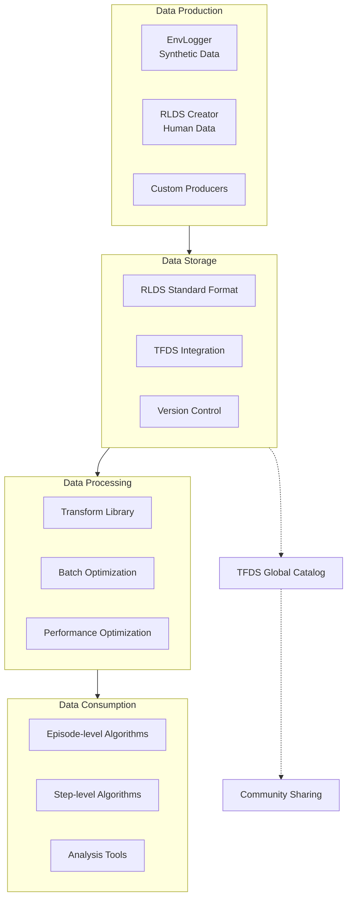
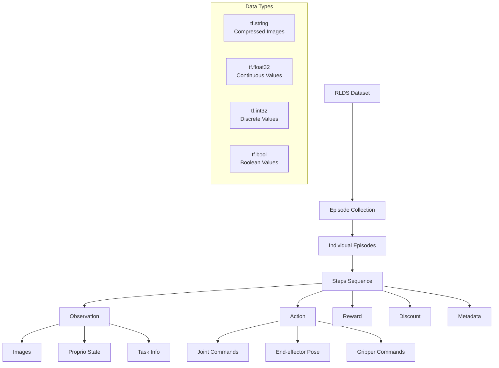
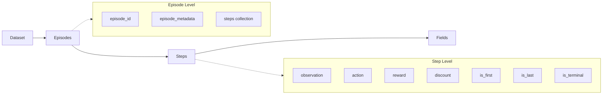
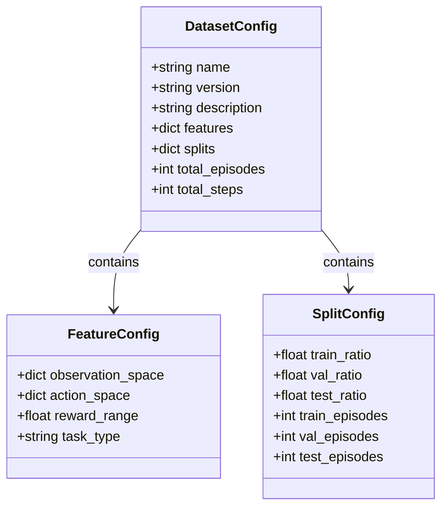
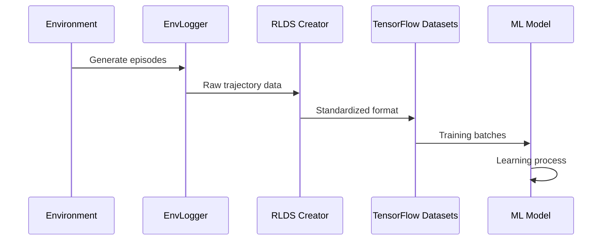

# RLDS 图表演示 (修复版本)

## RLDS生态系统架构

## RLDS数据架构

## RLDS数据结构层次

## 配置类结构

## 数据流转过程

## 修复说明

主要修复内容：
1. **子图名称标准化**：使用英文标识符，避免中文字符导致的解析错误
2. **节点内容格式化**：使用 ` ` 换行，避免特殊字符
3. **引用格式统一**：使用双引号包围含空格或特殊字符的内容
4. **连接语法规范**：确保箭头和连接线符合mermaid语法

这些修复确保图表在支持mermaid的环境中能够正确渲染。 