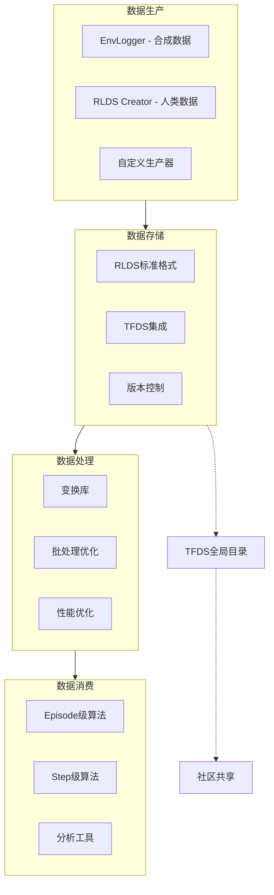
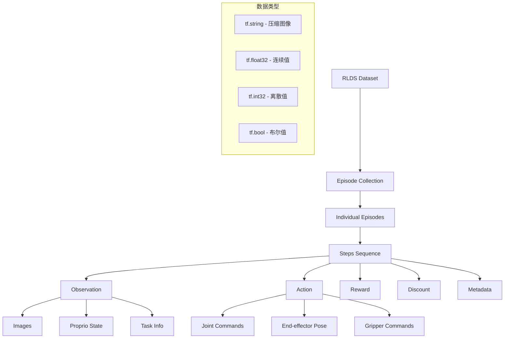
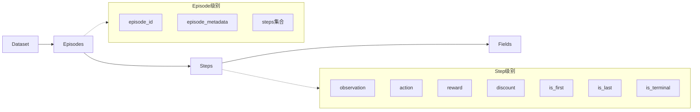
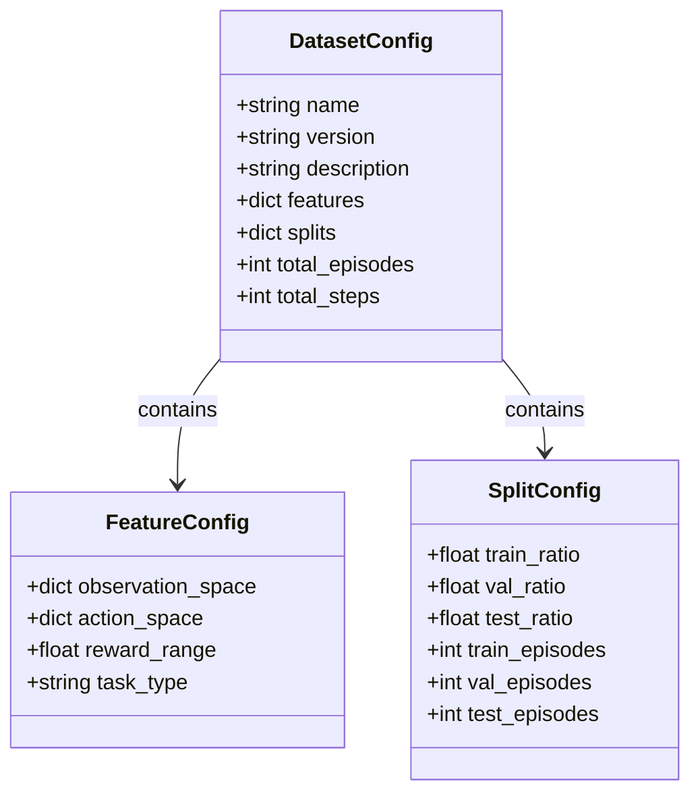
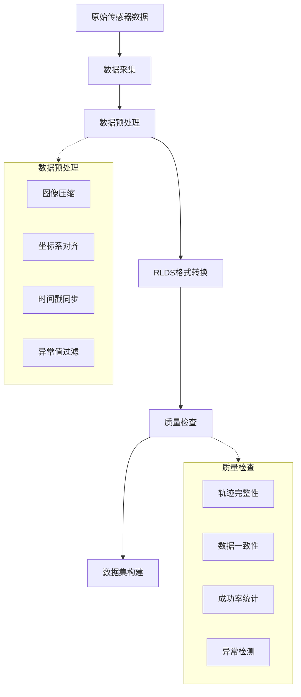
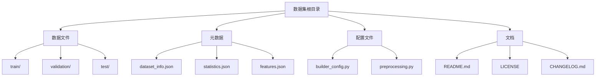

# RLDS (Reinforcement Learning Datasets) 详解

## 概述

RLDS (Reinforcement Learning Datasets) 是Google DeepMind开发的用于强化学习的标准化数据集格式。它基于TensorFlow Datasets (TFDS) 构建，专门设计用于存储和处理强化学习轨迹数据，包括机器人学习、游戏AI等各种序列决策任务。

**RLDS解决的核心问题：**
- 缺乏标准化的强化学习数据集格式
- 数据集格式不兼容导致算法无法重用
- 时序信息丢失（如随机化步骤顺序）
- 数据共享困难且易引入bug

**RLDS的核心价值：**
- **无损格式**：保留所有信息，维持时序关系
- **算法无关**：支持不同算法的数据消费模式
- **标准化**：统一的数据结构和语义
- **生态系统**：完整的数据生产、共享、消费工具链

## RLDS生态系统架构



## RLDS架构图



## RLDS数据结构层次



## 核心数据结构

### Episode 结构
| 字段名 | 类型 | 描述 | 示例 |
|--------|------|------|------|
| `episode_id` | `tf.string` | 唯一标识符 | `"episode_001"` |
| `episode_metadata` | `dict` | 元数据信息 | `{"task": "pick_cup", "success": True}` |
| `steps` | `Sequence[Step]` | 步骤序列 | `[step_0, step_1, ..., step_n]` |

### Step 结构
| 字段名 | 类型 | 形状 | 描述 |
|--------|------|------|------|
| `observation` | `dict` | 可变 | 观测数据字典 |
| `action` | `tf.float32` | `[action_dim]` | 动作向量 |
| `reward` | `tf.float32` | `[]` | 奖励值 |
| `discount` | `tf.float32` | `[]` | 折扣因子 |
| `is_first` | `tf.bool` | `[]` | 是否为首步 |
| `is_last` | `tf.bool` | `[]` | 是否为末步 |
| `is_terminal` | `tf.bool` | `[]` | 是否终止 |

### Observation 结构示例
| 观测类型 | 字段名 | 类型 | 形状 | 描述 |
|----------|--------|------|------|------|
| 图像 | `image_primary` | `tf.string` | `[]` | 主摄像头图像(JPEG编码) |
| 图像 | `image_wrist` | `tf.string` | `[]` | 手腕摄像头图像 |
| 图像 | `image_side` | `tf.string` | `[]` | 侧视图像 |
| 深度 | `depth_primary` | `tf.string` | `[]` | 深度图像 |
| 状态 | `joint_positions` | `tf.float32` | `[7]` | 关节位置 |
| 状态 | `joint_velocities` | `tf.float32` | `[7]` | 关节速度 |
| 状态 | `end_effector_pose` | `tf.float32` | `[7]` | 末端执行器位姿 |
| 状态 | `gripper_state` | `tf.float32` | `[1]` | 夹爪状态 |
| 任务 | `task_description` | `tf.string` | `[]` | 任务描述 |
| 任务 | `goal_image` | `tf.string` | `[]` | 目标图像 |

## 示例数据集构建

### 数据集配置信息



### 示例：抓取任务数据集

#### 数据集元信息
| 属性 | 值 |
|------|-----|
| 数据集名称 | `robot_pick_place_v1` |
| 版本 | `1.0.0` |
| 任务类型 | `Pick and Place` |
| 机器人平台 | `Franka Panda` |
| 总episode数 | `10,000` |
| 总步数 | `500,000` |
| 平均episode长度 | `50 steps` |

#### Episode示例数据

**Episode 1 元数据**
```json
{
    "episode_id": "episode_0001",
    "task_type": "pick_red_cube",
    "success": true,
    "duration_seconds": 12.5,
    "robot_id": "franka_001",
    "scene_id": "kitchen_table_01",
    "difficulty": "easy",
    "annotations": {
        "pick_frame": 15,
        "place_frame": 42,
        "contact_frames": [16, 43]
    }
}
```

#### Step数据结构详解

**Step 0 (初始状态)**
| 字段 | 值 | 说明 |
|------|-----|------|
| `is_first` | `True` | 轨迹开始 |
| `is_last` | `False` | 非结束步 |
| `is_terminal` | `False` | 非终止步 |
| `reward` | `0.0` | 初始奖励 |
| `discount` | `1.0` | 标准折扣 |

**观测数据 (Step 0)**
| 观测项 | 数据类型 | 形状 | 示例值/描述 |
|--------|----------|------|-------------|
| `image_primary` | `tf.string` | `[]` | JPEG编码的RGB图像 (480×640×3) |
| `image_wrist` | `tf.string` | `[]` | JPEG编码的手腕相机图像 (240×320×3) |
| `depth_primary` | `tf.string` | `[]` | 压缩的深度图 (480×640×1) |
| `joint_positions` | `tf.float32` | `[7]` | `[0.0, -0.785, 0.0, -2.356, 0.0, 1.571, 0.785]` |
| `joint_velocities` | `tf.float32` | `[7]` | `[0.0, 0.0, 0.0, 0.0, 0.0, 0.0, 0.0]` |
| `end_effector_pose` | `tf.float32` | `[7]` | `[0.5, 0.0, 0.3, 0.0, 0.0, 0.0, 1.0]` (位置+四元数) |
| `gripper_state` | `tf.float32` | `[1]` | `[0.08]` (开启状态) |
| `task_description` | `tf.string` | `[]` | `"Pick up the red cube and place it in the box"` |

**动作数据 (Step 0→1)**
| 动作维度 | 值 | 说明 |
|----------|-----|------|
| `delta_pos_x` | `0.02` | X轴位移 (m) |
| `delta_pos_y` | `0.01` | Y轴位移 (m) |
| `delta_pos_z` | `-0.005` | Z轴位移 (m) |
| `delta_rot_x` | `0.0` | X轴旋转 (rad) |
| `delta_rot_y` | `0.0` | Y轴旋转 (rad) |
| `delta_rot_z` | `0.1` | Z轴旋转 (rad) |
| `gripper_cmd` | `0.0` | 夹爪命令 (保持开启) |

## 数据处理流水线



## 数据加载示例

### Python代码示例
```python
import tensorflow_datasets as tfds
import tensorflow as tf

# 加载数据集
ds_builder = tfds.builder('robot_pick_place_v1', data_dir='/path/to/data')
ds = ds_builder.as_dataset(split='train', shuffle_files=True)

# 检查数据结构
print("Dataset info:")
print(ds_builder.info)

# 遍历episodes
for episode in ds.take(1):
    print(f"Episode ID: {episode['episode_id']}")
    print(f"Episode steps: {len(episode['steps'])}")
    
    # 查看第一步
    first_step = episode['steps'][0]
    print(f"First step observation keys: {first_step['observation'].keys()}")
    print(f"Action shape: {first_step['action'].shape}")
```

### 数据统计信息

#### 数据集分割
| 分割 | Episode数 | 步数 | 成功率 | 平均长度 |
|------|-----------|------|--------|----------|
| Train | 8,000 | 400,000 | 85% | 50 steps |
| Validation | 1,000 | 50,000 | 83% | 50 steps |
| Test | 1,000 | 50,000 | 82% | 50 steps |

#### 动作统计
| 动作维度 | 最小值 | 最大值 | 均值 | 标准差 |
|----------|--------|--------|------|--------|
| `delta_pos_x` | -0.05 | 0.05 | 0.001 | 0.012 |
| `delta_pos_y` | -0.05 | 0.05 | -0.002 | 0.015 |
| `delta_pos_z` | -0.05 | 0.05 | 0.000 | 0.008 |
| `delta_rot_x` | -0.2 | 0.2 | 0.003 | 0.045 |
| `delta_rot_y` | -0.2 | 0.2 | -0.001 | 0.038 |
| `delta_rot_z` | -0.2 | 0.2 | 0.005 | 0.052 |
| `gripper_cmd` | -1.0 | 1.0 | 0.12 | 0.68 |

## 与其他格式对比

### 数据格式对比表
| 特性 | RLDS | HDF5 | ROS Bag | OpenAI Gym |
|------|------|------|---------|------------|
| 标准化程度 | 高 | 中 | 低 | 中 |
| 元数据支持 | 优秀 | 良好 | 优秀 | 基础 |
| 压缩效率 | 高 | 高 | 中 | 低 |
| 查询性能 | 优秀 | 良好 | 差 | 良好 |
| 生态系统 | TF/JAX | 通用 | ROS | RL社区 |
| 版本控制 | 支持 | 有限 | 无 | 无 |
| 分布式训练 | 原生支持 | 需要额外工具 | 复杂 | 复杂 |

## 最佳实践

### 数据组织建议


### 数据质量检查清单
| 检查项 | 重要性 | 描述 |
|--------|--------|------|
| 轨迹完整性 | 高 | 确保每个episode都有完整的开始和结束 |
| 时间一致性 | 高 | 检查时间戳的单调性和合理性 |
| 动作合理性 | 高 | 验证动作在物理约束范围内 |
| 图像质量 | 中 | 检查图像是否清晰、无损坏 |
| 标注准确性 | 高 | 验证成功/失败标注的准确性 |
| 数据平衡性 | 中 | 确保不同任务场景的平衡分布 |

## 扩展和定制

### 自定义观测空间
```python
# 添加自定义观测
custom_observation_spec = {
    'image_overhead': tfds.features.Image(shape=(480, 640, 3)),
    'force_torque': tfds.features.Tensor(shape=(6,), dtype=tf.float32),
    'tactile_sensor': tfds.features.Tensor(shape=(16,), dtype=tf.float32),
    'audio_data': tfds.features.Audio(sample_rate=16000),
}
```

### 任务特定字段
| 任务类型 | 特定字段 | 类型 | 描述 |
|----------|----------|------|------|
| 抓取任务 | `grasp_success` | `tf.bool` | 抓取是否成功 |
| 导航任务 | `collision_detected` | `tf.bool` | 是否发生碰撞 |
| 操作任务 | `contact_forces` | `tf.float32[6]` | 接触力信息 |
| 学习任务 | `demonstration_id` | `tf.string` | 示教ID |

## RLDS核心组件详解

### 1. EnvLogger - 合成数据收集

EnvLogger是dm_env环境包装器，用于记录智能体与环境的交互：

```python
import envlogger

# 基本用法
env = envlogger.EnvLogger(
    environment=base_env,
    data_directory='/tmp/my_dataset'
)

# 高级用法 - 添加元数据回调
def step_metadata_fn(timestep, action, env):
    return {
        'custom_reward': compute_custom_reward(timestep),
        'difficulty': env.get_difficulty()
    }

def episode_metadata_fn(env):
    return {
        'success': env.is_success(),
        'episode_length': env.step_count()
    }

env = envlogger.EnvLogger(
    environment=base_env,
    data_directory='/tmp/my_dataset',
    step_metadata_fn=step_metadata_fn,
    episode_metadata_fn=episode_metadata_fn
)
```

**EnvLogger数据流**：
```
生成: (o_0, _, _, _, m_0) → (o_1, a_0, r_0, d_0, m_1) → (o_2, a_1, r_1, d_1, m_2)
存储: (o_0, a_0, r_0, d_0, m_0) → (o_1, a_1, r_1, d_1, m_1) → (o_2, a_2, r_2, d_2, m_2)
```

### 2. RLDS Creator - 人类数据收集

基于Web的工具，允许人类通过浏览器与环境交互：

**特性：**
- 跨平台Web界面
- 实时数据记录
- 支持多种输入设备
- 众包数据收集支持

### 3. TFDS集成

#### 数据集加载方式

```python
import tensorflow_datasets as tfds

# 方式1: 从目录加载
ds = tfds.builder_from_directory('/path/to/dataset').as_dataset(split='all')

# 方式2: 从多个目录加载
ds = tfds.builder_from_directories(['/path1', '/path2']).as_dataset(split='all')

# 方式3: 从TFDS目录加载
ds = tfds.load('d4rl_mujoco_halfcheetah/v0-medium')['train']

# 方式4: 批量加载(非嵌套格式)
ds = tfds.load('dataset_name', 
               decoders={rlds.STEPS: tfds.decode.SkipDecoding()},
               split='train')
```

## RLDS对TFDS的革命性扩展

RLDS不仅是TFDS的简单用户，而是对TFDS进行了深度扩展和改进，专门针对强化学习数据的特殊需求。以下是RLDS在TFDS基础上做出的关键创新和改进：

### 1. 嵌套数据集结构支持

#### 传统TFDS的局限性
```python
# 传统TFDS - 扁平化数据结构
traditional_sample = {
    'image': tf.Tensor(...),
    'label': tf.Tensor(...),
    'metadata': tf.Tensor(...)
}
```

#### RLDS的嵌套数据集创新
```python
# RLDS - 嵌套数据集结构
rlds_episode = {
    'episode_id': tf.string,
    'episode_metadata': {
        'success': tf.bool,
        'task_id': tf.string,
        'collector_id': tf.string
    },
    'steps': tf.data.Dataset.from_generator(...)  # 嵌套数据集！
}
```

**核心创新点：**
- **嵌套tf.data.Dataset**：RLDS在TFDS中首次实现了数据集内嵌套数据集的支持
- **时序数据保护**：确保episode内步骤的时序关系不被破坏
- **动态长度支持**：每个episode可以有不同的步数

### 2. 专用的RLDS Builder基类

RLDS扩展了TFDS的Builder架构，提供了专门的基类：

```python
import tensorflow_datasets as tfds
import rlds

class RoboticDatasetBuilder(tfds.core.GeneratorBasedBuilder):
    """RLDS专用的数据集构建器"""
    
    def _info(self) -> tfds.core.DatasetInfo:
        return tfds.core.DatasetInfo(
            builder=self,
            description="RLDS compliant robotic dataset",
            features=tfds.features.FeaturesDict({
                # Episode级元数据
                'episode_id': tfds.features.Text(),
                'episode_metadata': tfds.features.FeaturesDict({
                    'success': tfds.features.Scalar(dtype=tf.bool),
                    'task': tfds.features.Text(),
                    'total_reward': tfds.features.Scalar(dtype=tf.float32),
                }),
                
                # 核心创新：嵌套数据集结构
                'steps': tfds.features.Dataset({
                    # Step级数据结构
                    'observation': tfds.features.FeaturesDict({
                        # 支持多模态观测
                        'image_primary': tfds.features.Image(shape=(224, 224, 3)),
                        'image_wrist': tfds.features.Image(shape=(128, 128, 3)),
                        'depth': tfds.features.Tensor(shape=(224, 224, 1), dtype=tf.float32),
                        'proprioception': tfds.features.Tensor(shape=(7,), dtype=tf.float32),
                        'gripper_state': tfds.features.Scalar(dtype=tf.float32),
                    }),
                    'action': tfds.features.Tensor(shape=(7,), dtype=tf.float32),
                    'reward': tfds.features.Scalar(dtype=tf.float32),
                    'discount': tfds.features.Scalar(dtype=tf.float32),
                    
                    # RLDS标准字段
                    'is_first': tfds.features.Scalar(dtype=tf.bool),
                    'is_last': tfds.features.Scalar(dtype=tf.bool),
                    'is_terminal': tfds.features.Scalar(dtype=tf.bool),
                    
                    # 可扩展的元数据
                    'step_metadata': tfds.features.FeaturesDict({
                        'timestamp': tfds.features.Scalar(dtype=tf.float64),
                        'control_frequency': tfds.features.Scalar(dtype=tf.float32),
                    }),
                })
            }),
            supervised_keys=None,  # RL数据没有监督学习的键
            homepage='https://robotics-dataset.example.com',
            citation=BIBTEX_CITATION,
        )
    
    def _generate_examples(self, data_path):
        """生成RLDS兼容的样本"""
        for episode_idx, episode_data in enumerate(self._load_episodes(data_path)):
            # 构建步骤序列
            steps = []
            for step_idx, step_data in enumerate(episode_data['trajectory']):
                step = {
                    'observation': {
                        'image_primary': step_data['cam_primary'],
                        'image_wrist': step_data['cam_wrist'],
                        'depth': step_data['depth_map'],
                        'proprioception': step_data['joint_positions'],
                        'gripper_state': step_data['gripper_pos'],
                    },
                    'action': step_data['action'],
                    'reward': step_data['reward'],
                    'discount': step_data.get('discount', 1.0),
                    'is_first': step_idx == 0,
                    'is_last': step_idx == len(episode_data['trajectory']) - 1,
                    'is_terminal': step_data.get('terminal', False),
                    'step_metadata': {
                        'timestamp': step_data['timestamp'],
                        'control_frequency': step_data['freq'],
                    }
                }
                steps.append(step)
            
            # 构建完整episode
            episode = {
                'episode_id': f"episode_{episode_idx:06d}",
                'episode_metadata': {
                    'success': episode_data['metadata']['success'],
                    'task': episode_data['metadata']['task_name'],
                    'total_reward': sum(s['reward'] for s in steps),
                },
                'steps': steps
            }
            
            yield f"episode_{episode_idx}", episode
```

### 3. 高级数据变换框架

RLDS为TFDS添加了专门的变换框架，支持复杂的RL数据处理：

#### a) Episode级变换
```python
import rlds.transformations as rlds_transforms

def advanced_episode_transform():
    """高级episode变换示例"""
    
    def add_episode_statistics(episode):
        """为episode添加统计信息"""
        steps = episode[rlds.STEPS]
        
        # 计算episode级统计
        total_steps = tf.data.experimental.cardinality(steps)
        rewards = steps.map(lambda s: s['reward'])
        total_reward = rewards.reduce(tf.constant(0.0), tf.add)
        
        # 添加到元数据
        episode['episode_metadata']['episode_length'] = total_steps
        episode['episode_metadata']['total_reward'] = total_reward
        return episode
    
    def filter_successful_episodes(episode):
        """过滤成功的episode"""
        return episode['episode_metadata']['success']
    
    def normalize_rewards(episode):
        """归一化奖励"""
        def normalize_step(step):
            # 应用z-score归一化
            normalized_reward = (step['reward'] - reward_mean) / reward_std
            step['reward'] = normalized_reward
            return step
        
        steps = episode[rlds.STEPS].map(normalize_step)
        episode[rlds.STEPS] = steps
        return episode
    
    return [add_episode_statistics, filter_successful_episodes, normalize_rewards]
```

#### b) Step级高级变换
```python
def advanced_step_transforms():
    """高级step变换示例"""
    
    def augment_observations(step):
        """数据增强"""
        obs = step['observation']
        
        # 图像增强
        if 'image_primary' in obs:
            image = obs['image_primary']
            # 随机颜色抖动
            image = tf.image.random_hue(image, max_delta=0.1)
            image = tf.image.random_saturation(image, lower=0.8, upper=1.2)
            obs['image_primary'] = image
        
        step['observation'] = obs
        return step
    
    def add_next_observation(step, next_step):
        """添加下一步观测（用于Q学习等）"""
        step['next_observation'] = next_step['observation']
        return step
    
    def compute_advantage(step, value_estimate):
        """计算优势函数（用于策略梯度）"""
        step['advantage'] = step['reward'] + 0.99 * value_estimate - step['value']
        return step
    
    return [augment_observations, add_next_observation, compute_advantage]
```

### 4. 并行化数据构建支持

RLDS扩展了TFDS的Apache Beam支持，实现高效的并行数据处理：

```python
# 传统TFDS构建
tfds build

# RLDS并行构建
tfds build --overwrite --beam_pipeline_options="direct_running_mode=multi_processing,direct_num_workers=16"
```

#### 自定义并行处理器
```python
class RLDSParallelBuilder(tfds.core.GeneratorBasedBuilder):
    """支持并行处理的RLDS构建器"""
    
    def _generate_examples(self, data_path):
        """支持Beam并行处理的生成器"""
        import apache_beam as beam
        
        # 创建Beam管道
        with beam.Pipeline() as pipeline:
            episodes = (
                pipeline
                | 'CreateEpisodePaths' >> beam.Create(self._get_episode_paths(data_path))
                | 'ProcessEpisodes' >> beam.Map(self._process_single_episode)
                | 'ValidateEpisodes' >> beam.Filter(self._is_valid_episode)
                | 'FormatForTFDS' >> beam.Map(self._format_for_tfds)
            )
        
        return episodes
    
    def _process_single_episode(self, episode_path):
        """处理单个episode（并行执行）"""
        # 这个函数会在多个worker上并行执行
        raw_data = self._load_episode_data(episode_path)
        processed_episode = self._convert_to_rlds_format(raw_data)
        return processed_episode
```

### 5. 数据集修改和转换框架

RLDS提供了强大的数据集后处理能力：

```python
# 使用RLDS数据集修改框架
python modify_rlds_dataset.py \
    --dataset=my_robot_dataset \
    --mods=resize_images,add_language_conditioning,normalize_actions \
    --target_dir=/path/to/modified/dataset \
    --n_workers=16

# 支持的修改操作
SUPPORTED_MODIFICATIONS = {
    'resize_images': ResizeImagesTransform(target_size=(224, 224)),
    'jpeg_encode': JpegEncodeTransform(quality=95),
    'add_language_conditioning': AddLanguageConditioningTransform(),
    'normalize_actions': NormalizeActionsTransform(),
    'filter_by_success': FilterBySuccessTransform(),
    'subsample_timesteps': SubsampleTimestepsTransform(factor=2),
    'add_goal_conditioning': AddGoalConditioningTransform(),
}
```

#### 自定义修改函数
```python
class CustomRLDSModification:
    """自定义RLDS数据修改"""
    
    def modify_dataset_info(self, info):
        """修改数据集信息"""
        # 添加新的特征
        features = info.features.copy()
        features['steps']['goal_image'] = tfds.features.Image(shape=(224, 224, 3))
        
        return info._replace(features=features)
    
    def modify_example(self, example):
        """修改单个样本"""
        steps = example['steps']
        
        # 为每个step添加目标图像
        def add_goal_to_step(step):
            # 使用最后一步的观测作为目标
            step['goal_image'] = steps[-1]['observation']['image_primary']
            return step
        
        modified_steps = steps.map(add_goal_to_step)
        example['steps'] = modified_steps
        
        return example
```

### 6. 专用的RLDS验证框架

RLDS扩展了TFDS的验证机制，增加了RL特定的检查：

```python
class RLDSValidator:
    """RLDS数据集验证器"""
    
    def validate_episode_structure(self, episode):
        """验证episode结构"""
        checks = [
            self._check_required_fields(episode),
            self._check_step_consistency(episode),
            self._check_temporal_ordering(episode),
            self._check_terminal_states(episode),
            self._check_reward_validity(episode),
        ]
        
        return all(checks)
    
    def _check_step_consistency(self, episode):
        """检查步骤一致性"""
        steps = episode['steps']
        
        # 检查第一步标记
        first_step = next(iter(steps))
        if not first_step['is_first']:
            raise ValueError("First step must have is_first=True")
        
        # 检查最后一步标记
        step_count = 0
        last_step = None
        for step in steps:
            step_count += 1
            last_step = step
        
        if not last_step['is_last']:
            raise ValueError("Last step must have is_last=True")
        
        return True
    
    def _check_temporal_ordering(self, episode):
        """检查时间序列完整性"""
        steps = list(episode['steps'])
        
        # 验证时间戳单调递增
        if 'timestamp' in steps[0].get('step_metadata', {}):
            timestamps = [s['step_metadata']['timestamp'] for s in steps]
            if not all(t1 <= t2 for t1, t2 in zip(timestamps, timestamps[1:])):
                raise ValueError("Timestamps must be non-decreasing")
        
        return True
```

### 7. Open X-Embodiment数据集集成

RLDS为大规模机器人数据集提供了专门的支持：

```python
# Open X-Embodiment数据集下载和处理
bash prepare_open_x.sh

# 支持的数据集转换
OPEN_X_DATASETS = [
    'bridge_v2',
    'rt_1',
    'berkeley_autolab_ur5',
    'taco_play',
    'kuka_multimodal',
    'stanford_robocook',
    # ... 50+ 数据集
]

# 统一的变换接口
def transform_for_x_embodiment(step):
    """转换为X-embodiment标准格式"""
    return {
        'observation': {
            'image': step['observation']['image_primary'],  # 单一RGB输入
            'natural_language_embedding': step['language_embedding'],
        },
        'action': step['action'][:7],  # 标准7-DOF动作
        'reward': step['reward'],
        'is_first': step['is_first'],
        'is_last': step['is_last'],
        'is_terminal': step['is_terminal'],
    }
```

### 8. 高级性能优化

RLDS实现了针对RL数据的专门优化：

#### a) 智能缓存策略
```python
class RLDSCachingStrategy:
    """RLDS专用缓存策略"""
    
    def __init__(self):
        self.episode_cache = {}
        self.step_cache = {}
    
    def cache_episode(self, episode_id, episode):
        """缓存完整episode"""
        # 只缓存小型episode，避免内存溢出
        if self._estimate_episode_size(episode) < 100_000_000:  # 100MB
            self.episode_cache[episode_id] = episode
    
    def cache_step_sequence(self, episode_id, start_idx, steps):
        """缓存步骤序列（用于N-step学习）"""
        cache_key = f"{episode_id}_{start_idx}"
        self.step_cache[cache_key] = steps
```

#### b) 自适应批处理
```python
def adaptive_batching(dataset, target_memory_usage=8_000_000_000):  # 8GB
    """根据内存使用情况自适应调整批大小"""
    
    def estimate_sample_size(sample):
        """估算样本内存使用"""
        size = 0
        for step in sample['steps']:
            for key, value in step['observation'].items():
                if 'image' in key:
                    size += value.shape.num_elements() * 4  # float32
                else:
                    size += value.shape.num_elements() * value.dtype.size
        return size
    
    # 动态计算批大小
    sample = next(iter(dataset))
    sample_size = estimate_sample_size(sample)
    optimal_batch_size = max(1, target_memory_usage // sample_size)
    
    return dataset.batch(optimal_batch_size)
```

### 9. 与现有生态系统的兼容性

RLDS确保与TensorFlow生态系统的完美兼容：

```python
# 与tf.data的无缝集成
rlds_dataset = tfds.load('my_robot_dataset')
tf_data_pipeline = (
    rlds_dataset['train']
    .flat_map(lambda ep: ep['steps'])  # 展平为step级数据
    .map(preprocess_function)
    .batch(32)
    .prefetch(tf.data.AUTOTUNE)
)

# 与tf.saved_model的兼容
@tf.function
def process_rlds_batch(batch):
    """处理RLDS批次数据"""
    observations = batch['observation']['image']
    actions = batch['action']
    return model(observations), actions

# 保存为SavedModel
tf.saved_model.save(process_rlds_batch, '/path/to/saved_model')
```

## 引用和致谢

如果使用RLDS，请引用官方论文：

```bibtex
@misc{ramos2021rlds,
    title={RLDS: an Ecosystem to Generate, Share and Use Datasets in Reinforcement Learning},
    author={Sabela Ramos and Sertan Girgin and Léonard Hussenot and Damien Vincent and Hanna Yakubovich and Daniel Toyama and Anita Gergely and Piotr Stanczyk and Raphael Marinier and Jeremiah Harmsen and Olivier Pietquin and Nikola Momchev},
    year={2021},
    eprint={2111.02767},
    archivePrefix={arXiv},
    primaryClass={cs.LG}
}
```

### 使用RLDS的重要论文

- **Hyperparameter Selection for Imitation Learning** (ICML 2021)
- **Continuous Control with Action Quantization from Demonstrations** (NeurIPS 2021)  
- **What Matters for Adversarial Imitation Learning?** (NeurIPS 2021)
- **MT-Opt: Continuous Multi-Task Robotic Reinforcement Learning at Scale**
- **Offline Reinforcement Learning with Pseudometric Learning** (ICML 2021)

## 总结

RLDS提供了一个标准化、高效的强化学习数据存储和处理框架。其主要优势包括：

1. **标准化格式**：统一的数据结构便于不同项目间的数据共享
2. **高效存储**：基于TensorFlow的优化存储格式  
3. **丰富元数据**：支持详细的任务和轨迹标注
4. **易于处理**：与现代机器学习工具链无缝集成
5. **可扩展性**：支持自定义观测空间和任务特定字段
6. **性能优化**：针对RL数据特点的专门优化
7. **社区生态**：活跃的开源社区和丰富的数据集资源

通过使用RLDS，研究者可以更容易地构建、共享和使用大规模强化学习数据集，推动强化学习技术的发展。 

## 高级数据结构规范

### Episode元数据扩展规范

基于官方GitHub仓库，Episode支持以下标准元数据字段：

| 字段名 | 类型 | 必需 | 描述 | 示例 |
|--------|------|------|------|------|
| `episode_id` | `tf.string` | 推荐 | 全局唯一标识符 | `"dataset_v1_episode_12345"` |
| `agent_id` | `tf.string/tf.Tensor` | 可选 | 智能体标识符(支持多智能体) | `"sac_agent_v2"` 或 `[[agent_name, agent_id], ...]` |
| `environment_config` | `dict` | 可选 | 环境配置参数 | `{"gravity": -9.8, "friction": 0.1}` |
| `experiment_id` | `tf.string` | 可选 | 实验标识符 | `"exp_20231215_hyperopt"` |
| `invalid` | `tf.bool` | 可选 | 无效episode标记 | `False` |

### Step字段完整规范

#### 必需字段
| 字段名 | 类型 | 描述 | 重要说明 |
|--------|------|------|----------|
| `is_first` | `tf.bool` | 是否为首步 | 包含初始状态 |
| `is_last` | `tf.bool` | 是否为末步 | 当为True时，后续字段无效 |

#### 可选字段
| 字段名 | 类型 | 描述 | 条件约束 |
|--------|------|------|----------|
| `observation` | `dict` | 当前观测 | 结构在数据集内必须一致 |
| `action` | `tf.Tensor` | 执行的动作 | `is_last=True`时无效 |
| `reward` | `tf.float32` | 获得的奖励 | `is_last=True`时无效 |
| `discount` | `tf.float32` | 折扣因子 | 通常为1.0或γ |
| `is_terminal` | `tf.bool` | 是否为终止状态 | 区分截断vs终止 |

#### 终止状态语义
```python
# 自然终止 (游戏结束)
{
    'is_last': True,
    'is_terminal': True,
    'observation': final_obs,  # 有效的最终观测
    'action': None,           # 无效
    'reward': None,           # 无效
    'discount': None          # 无效
}

# 截断终止 (时间限制)
{
    'is_last': True,
    'is_terminal': False,
    'observation': final_obs,  # 有效的截断观测
    'action': None,           # 可能无效
    'reward': final_reward,   # 可能有效
    'discount': gamma         # 可能有效
}
```

## RLDS变换库详解

### 核心变换操作

RLDS提供优化的变换库，考虑了RL数据集的嵌套结构：

```python
import rlds

# 1. Episode级变换
def process_episode(episode):
    steps = episode[rlds.STEPS]
    # 添加自定义episode统计
    episode_length = tf.data.experimental.cardinality(steps)
    episode['metadata']['length'] = episode_length
    return episode

dataset = dataset.map(process_episode)

# 2. Step级变换 - 展平episode
step_dataset = episode_dataset.flat_map(lambda x: x[rlds.STEPS])

# 3. 窗口化变换 - N步转移
def make_n_step_transitions(episode, n=5):
    steps = episode[rlds.STEPS]
    windowed = steps.window(n, shift=1, drop_remainder=True)
    return windowed.flat_map(lambda w: w.batch(n))

# 4. 过滤变换
def filter_successful_episodes(episode):
    return episode['metadata']['success'] == True

dataset = dataset.filter(filter_successful_episodes)
```

### 高性能批处理

```python
# 自动批处理 - 考虑episode边界
def smart_batch(dataset, batch_size, respect_episode_boundaries=True):
    if respect_episode_boundaries:
        # 确保batch内的step来自同一episode
        return dataset.flat_map(
            lambda ep: ep[rlds.STEPS].batch(batch_size)
        )
    else:
        # 跨episode批处理
        return dataset.flat_map(
            lambda ep: ep[rlds.STEPS]
        ).batch(batch_size)

# 示例用法
batched_steps = smart_batch(dataset, batch_size=32, 
                           respect_episode_boundaries=False)
```

## 性能优化最佳实践

### 1. 内存优化

```python
# 减少内存使用的ReadConfig
read_config = tfds.ReadConfig(
    # 减少并行加载的文件数
    interleave_cycle_length=4,
    interleave_block_length=1,
    # 启用确定性读取
    shuffle_seed=42,
    shuffle_reshuffle_each_iteration=True
)

dataset = tfds.load('dataset_name', read_config=read_config)
```

### 2. 并行处理优化

```python
# 多进程数据加载
def optimized_pipeline(dataset_name, num_parallel_calls=tf.data.AUTOTUNE):
    dataset = tfds.load(dataset_name, shuffle_files=True)
    
    # 并行解码和预处理
    dataset = dataset.map(
        preprocess_function,
        num_parallel_calls=num_parallel_calls
    )
    
    # 预取优化
    dataset = dataset.prefetch(tf.data.AUTOTUNE)
    
    return dataset
```

### 3. 随机化策略

```python
# 方式1: 完美随机化 (高内存)
shuffled = dataset.shuffle(buffer_size=10000)  # 需要大缓冲区

# 方式2: 交错随机化 (内存友好)
def create_interleaved_dataset(dataset_name, num_copies=4):
    def dataset_loader():
        ds = tfds.load(dataset_name, shuffle_files=True)
        return ds.flat_map(lambda x: x[rlds.STEPS])
    
    # 创建多个独立随机化的数据集副本
    dataset = tf.data.Dataset.range(num_copies).interleave(
        lambda _: dataset_loader(),
        cycle_length=num_copies,
        block_length=1,
        num_parallel_calls=tf.data.AUTOTUNE
    )
    
    return dataset

# 方式3: 分片随机化 (避免重复)
def distributed_random_access(dataset_name, num_workers, worker_id):
    # 每个worker处理不同的分片
    split_name = f'train[{worker_id}shard{num_workers}]'
    return tfds.load(dataset_name, split=split_name, shuffle_files=True)
```

## 多智能体支持

RLDS原生支持多智能体场景：

```python
# 多智能体Episode结构
multi_agent_episode = {
    'episode_id': 'multi_agent_001',
    'agent_id': tf.constant([
        ['player_1', 'dqn_agent_v1'],
        ['player_2', 'human_expert'],
        ['env_bot', 'scripted_agent']
    ]),
    'steps': [
        {
            'observation': {
                'player_1': player1_obs,
                'player_2': player2_obs,
                'global': global_obs
            },
            'action': {
                'player_1': player1_action,
                'player_2': player2_action
            },
            'reward': {
                'player_1': player1_reward,
                'player_2': player2_reward
            },
            'is_first': True,
            'is_last': False,
            'is_terminal': False
        }
    ]
}
```

## 可用数据集生态

### 官方支持的数据集

| 数据集系列 | 领域 | 任务数量 | 描述 |
|------------|------|----------|------|
| **D4RL** | 机器人/游戏 | 34+ | Mujoco, Adroit, AntMaze任务 |
| **RL Unplugged** | 多领域 | 50+ | DMLab, Atari, 真实世界RL |
| **Robosuite** | 机器人操作 | 3 | 用RLDS工具生成 |
| **Robomimic** | 机器人学习 | 15+ | 模仿学习数据集 |
| **MuJoCo Locomotion** | 运动控制 | 8 | SAC智能体生成 |
| **MT-Opt** | 机器人 | 1 | 大规模多任务数据集 |

### 数据集使用示例

```python
# 加载不同类型的数据集
datasets = {
    # 连续控制
    'mujoco': tfds.load('d4rl_mujoco_hopper/v1-medium'),
    
    # 离散控制  
    'atari': tfds.load('rl_unplugged_atari_breakout/run_1'),
    
    # 机器人操作
    'robot': tfds.load('robosuite_lift/human_demos'),
    
    # 导航任务
    'maze': tfds.load('d4rl_antmaze/umaze-v1')
}

# 统一处理接口
for name, dataset in datasets.items():
    print(f"\n{name.upper()} Dataset:")
    for episode in dataset['train'].take(1):
        steps = episode[rlds.STEPS]
        print(f"  Episode length: {tf.data.experimental.cardinality(steps)}")
        
        for step in steps.take(1):
            obs_keys = list(step['observation'].keys())
            action_shape = step['action'].shape
            print(f"  Observation keys: {obs_keys}")
            print(f"  Action shape: {action_shape}")
```

## 社区贡献和扩展

### 添加自定义数据集到TFDS

```python
import tensorflow_datasets as tfds

class MyRLDataset(tfds.core.GeneratorBasedBuilder):
    """自定义RLDS兼容数据集"""
    
    VERSION = tfds.core.Version('1.0.0')
    
    def _info(self) -> tfds.core.DatasetInfo:
        return tfds.core.DatasetInfo(
            builder=self,
            description="My custom RL dataset",
            features=tfds.features.FeaturesDict({
                'episode_id': tfds.features.Text(),
                'steps': tfds.features.Dataset({
                    'observation': tfds.features.FeaturesDict({
                        'image': tfds.features.Image(shape=(84, 84, 3)),
                        'state': tfds.features.Tensor(shape=(10,), dtype=tf.float32),
                    }),
                    'action': tfds.features.Tensor(shape=(4,), dtype=tf.float32),
                    'reward': tfds.features.Scalar(dtype=tf.float32),
                    'discount': tfds.features.Scalar(dtype=tf.float32),
                    'is_first': tfds.features.Scalar(dtype=tf.bool),
                    'is_last': tfds.features.Scalar(dtype=tf.bool),
                    'is_terminal': tfds.features.Scalar(dtype=tf.bool),
                })
            }),
            supervised_keys=None,
            homepage='https://my-dataset-homepage.com',
            citation="""@article{my2023dataset, ...}""",
        )
    
    def _split_generators(self, dl_manager):
        return [
            tfds.core.SplitGenerator(
                name=tfds.Split.TRAIN,
                gen_kwargs={'data_path': '/path/to/train/data'},
            ),
        ]
    
    def _generate_examples(self, data_path):
        # 实现数据生成逻辑
        for episode_file in episode_files:
            episode_id, steps = load_episode(episode_file)
            yield episode_id, {
                'episode_id': episode_id,
                'steps': steps
            }
```

## 实际应用案例

### 案例1: 离线强化学习

```python
def offline_rl_pipeline(dataset_name, algorithm='cql'):
    # 加载数据集
    dataset = tfds.load(dataset_name)['train']
    
    # 数据预处理
    def preprocess_for_offline_rl(episode):
        steps = episode[rlds.STEPS]
        
        # 计算return-to-go
        rewards = steps.map(lambda s: s['reward'])
        returns = compute_returns_to_go(rewards)
        
        # 添加return信息
        enriched_steps = tf.data.Dataset.zip((steps, returns))
        return enriched_steps.map(lambda step, ret: {
            **step, 'return_to_go': ret
        })
    
    processed_dataset = dataset.map(preprocess_for_offline_rl)
    
    # 转换为step级数据用于训练
    step_dataset = processed_dataset.flat_map(lambda x: x)
    
    return step_dataset.batch(256).prefetch(tf.data.AUTOTUNE)
```

### 案例2: 模仿学习

```python
def imitation_learning_pipeline(expert_dataset, student_dataset):
    # 加载专家数据
    expert_ds = tfds.load(expert_dataset)['train']
    expert_steps = expert_ds.flat_map(lambda ep: ep[rlds.STEPS])
    
    # 过滤成功的轨迹
    def is_successful_episode(episode):
        return episode.get('metadata', {}).get('success', True)
    
    expert_steps = expert_ds.filter(is_successful_episode)\
                           .flat_map(lambda ep: ep[rlds.STEPS])
    
    # 创建(observation, action)对
    bc_data = expert_steps.map(lambda step: {
        'observation': step['observation'],
        'action': step['action']
    }).filter(lambda x: not x.get('is_last', False))
    
    return bc_data.batch(128).prefetch(tf.data.AUTOTUNE)
```

### 案例3: 数据集分析

```python
def analyze_dataset(dataset_name):
    """全面分析RLDS数据集"""
    dataset = tfds.load(dataset_name)['train']
    
    # Episode级统计
    episode_lengths = []
    success_rates = []
    
    # Step级统计  
    action_stats = []
    reward_stats = []
    
    for episode in dataset:
        steps = episode[rlds.STEPS]
        
        # Episode分析
        episode_length = tf.data.experimental.cardinality(steps).numpy()
        episode_lengths.append(episode_length)
        
        success = episode.get('metadata', {}).get('success', None)
        if success is not None:
            success_rates.append(success.numpy())
        
        # Step分析
        for step in steps:
            if not step['is_last']:
                action_stats.append(step['action'].numpy())
                reward_stats.append(step['reward'].numpy())
    
    # 生成报告
    analysis_report = {
        'episode_count': len(episode_lengths),
        'avg_episode_length': np.mean(episode_lengths),
        'std_episode_length': np.std(episode_lengths),
        'success_rate': np.mean(success_rates) if success_rates else None,
        'total_steps': sum(episode_lengths),
        'action_dimensionality': action_stats[0].shape if action_stats else None,
        'reward_range': (np.min(reward_stats), np.max(reward_stats)) if reward_stats else None,
    }
    
    return analysis_report 