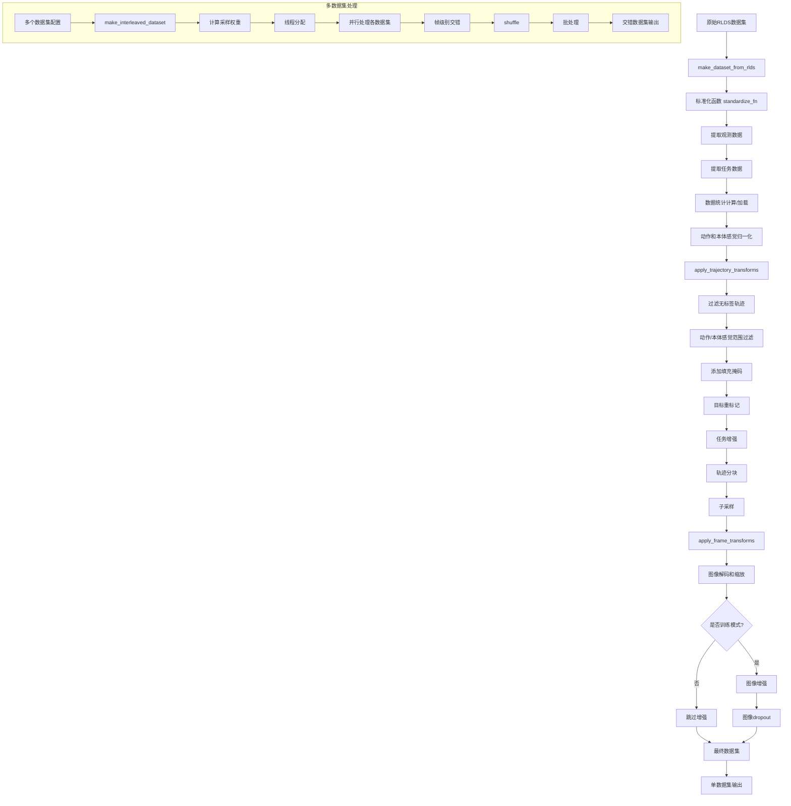
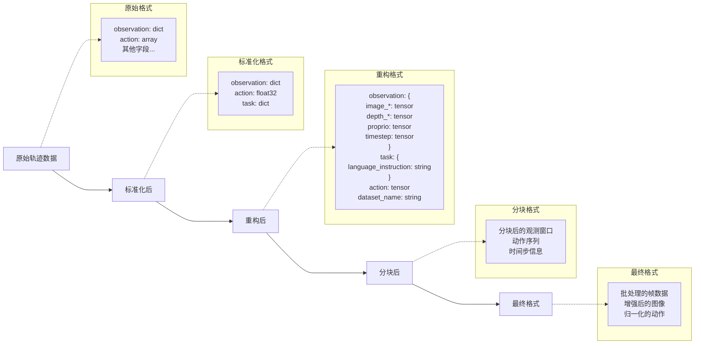
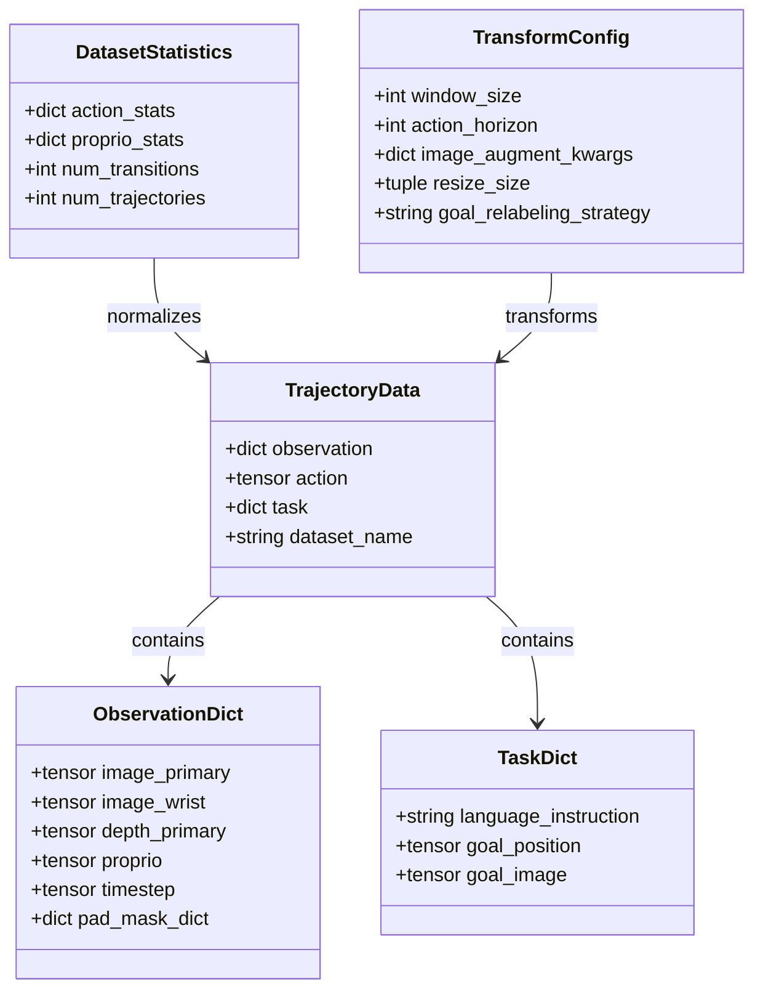
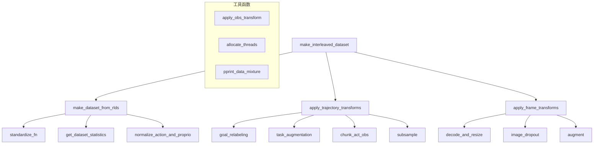
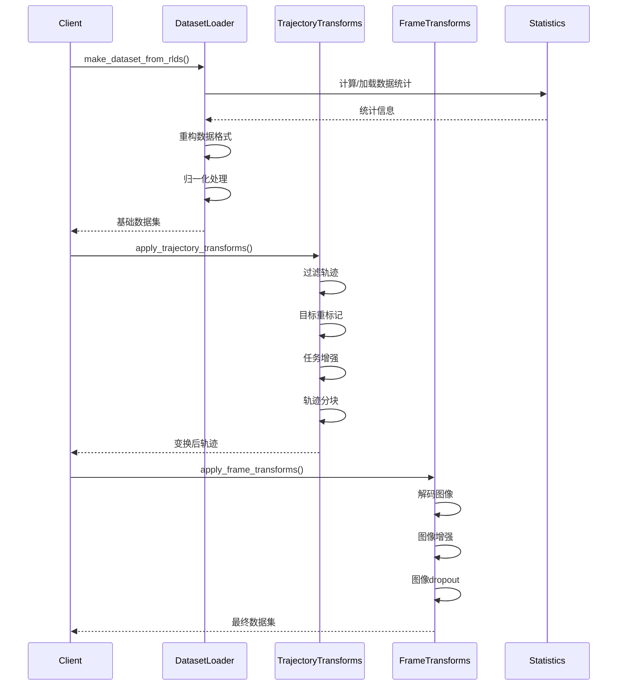

# Dataset.py 模块分析

## 数据处理流程图



## 数据结构转换流程



## 核心数据结构



## 关键函数关系图



## 数据流时序图



## 模块功能概述

这个模块是 Octo 机器人学习框架的核心数据处理组件，主要负责：

### 主要功能
1. **多格式数据集加载** - 支持从 RLDS (Robot Learning Dataset) 格式加载数据
2. **数据标准化** - 将不同来源的数据转换为统一的标准格式
3. **多模态数据处理** - 同时处理图像、深度图像、本体感觉数据和动作序列
4. **数据增强** - 支持图像增强、随机dropout等技术提高模型泛化能力
5. **多数据集融合** - 支持多个数据集的加权采样和交错处理
6. **高效并行处理** - 利用多线程和GPU加速数据处理管道

## 核心函数详解

### 1. make_dataset_from_rlds()
**功能**: 从RLDS格式加载单个数据集并标准化

**核心步骤**:
- 应用自定义的标准化函数
- 提取图像、深度图像、本体感觉数据
- 计算或加载数据统计信息用于归一化
- 重构数据为标准格式

**类型注解分析**:
```python
def make_dataset_from_rlds(
    name: str,  # 数据集名称
    data_dir: str,  # 数据目录路径
    *,
    train: bool,  # 训练/验证模式
    standardize_fn: Optional[ModuleSpec] = None,  # 可选的标准化函数
    image_obs_keys: Mapping[str, Optional[str]] = {},  # 图像观测映射
    action_proprio_normalization_type: NormalizationType = NormalizationType.NORMAL,
    # ... 其他参数
) -> Tuple[dl.DLataset, dict]:  # 返回数据集和统计信息
```

### 2. apply_trajectory_transforms()
**功能**: 应用轨迹级别的数据变换

**主要变换**:
- **过滤操作**: 移除无标签或超出范围的轨迹
- **目标重标记**: 为机器人学习任务重新标记目标
- **轨迹分块**: 将长轨迹切分为固定窗口大小的片段
- **任务增强**: 随机修改任务描述以增加多样性

**关键参数**:
```python
window_size: int = 1          # 观测窗口大小
action_horizon: int = 1       # 动作预测时间范围
subsample_length: Optional[int] = None  # 子采样长度
goal_relabeling_strategy: Optional[str] = None  # 目标重标记策略
```

### 3. apply_frame_transforms()
**功能**: 应用帧级别的数据变换（主要是图像处理）

**主要操作**:
- **图像解码和缩放**: 将压缩图像解码并调整尺寸
- **数据增强**: 训练时应用随机变换（旋转、缩放、颜色扰动等）
- **图像dropout**: 随机丢弃部分图像观测以提高鲁棒性

### 4. make_interleaved_dataset()
**功能**: 创建多数据集交错的训练数据流

**核心特性**:
- **权重采样**: 根据指定权重从不同数据集采样
- **负载均衡**: 智能分配计算资源到各个数据集
- **帧级交错**: 在帧级别混合不同数据集的数据

## 类型注解系统分析

该模块大量使用了 Python 的 `typing` 模块，体现了现代 Python 开发的最佳实践：

### 复杂类型定义
```python
# 联合类型 - 支持多种输入格式
Union[dict, Mapping[str, dict]]

# 映射类型 - 键值对结构
Mapping[str, Optional[str]]

# 元组类型 - 固定结构返回值
Tuple[dl.DLataset, dict]

# 序列类型 - 可变长度列表
Sequence[ModuleSpec]

# 可选类型 - 允许None值
Optional[str]
```

### 函数签名示例
```python
def apply_frame_transforms(
    dataset: dl.DLataset,  # 明确的数据集类型
    *,  # 强制关键字参数
    train: bool,  # 布尔标志
    image_augment_kwargs: Union[dict, Mapping[str, dict]] = {},  # 灵活的配置类型
    resize_size: Union[Tuple[int, int], Mapping[str, Tuple[int, int]]] = {},
    num_parallel_calls: int = tf.data.AUTOTUNE,  # 默认值
) -> dl.DLataset:  # 返回类型
```

## 数据流示例

### 单数据集处理流程
```python
# 1. 加载原始数据集
dataset, stats = make_dataset_from_rlds(
    name="robot_dataset_v1",
    data_dir="/path/to/data",
    train=True,
    image_obs_keys={"primary": "workspace", "wrist": "wrist"},
    proprio_obs_key="joint_states"
)

# 2. 应用轨迹变换
dataset = apply_trajectory_transforms(
    dataset,
    train=True,
    window_size=10,
    action_horizon=4,
    goal_relabeling_strategy="uniform"
)

# 3. 应用帧变换
dataset = apply_frame_transforms(
    dataset,
    train=True,
    resize_size={"primary": (256, 256), "wrist": (128, 128)},
    image_augment_kwargs={"augment_order": ["color", "geometric"]}
)
```

### 多数据集交错处理
```python
# 配置多个数据集
dataset_configs = [
    {"name": "dataset_A", "data_dir": "/path/A", ...},
    {"name": "dataset_B", "data_dir": "/path/B", ...},
    {"name": "dataset_C", "data_dir": "/path/C", ...},
]

# 创建交错数据集
interleaved_dataset = make_interleaved_dataset(
    dataset_kwargs_list=dataset_configs,
    sample_weights=[0.5, 0.3, 0.2],  # 采样权重
    train=True,
    shuffle_buffer_size=10000,
    batch_size=32,
    balance_weights=True  # 按数据集大小平衡权重
)
```

## 性能优化特性

### 1. 并行处理
- **多线程读取**: `num_parallel_reads` 控制并行读取线程数
- **并行变换**: `num_parallel_calls` 控制变换操作的并行度
- **智能线程分配**: 根据数据集权重分配计算资源

### 2. 内存管理
- **RAM预算控制**: `with_ram_budget(1)` 限制内存使用
- **惰性加载**: 数据按需加载和处理
- **缓存机制**: 数据统计信息的缓存机制

### 3. 错误处理
- **容错机制**: `ignore_errors()` 跳过损坏的数据
- **日志记录**: 详细的处理过程日志
- **数据验证**: 多层次的数据格式验证

## 配置系统

模块采用了灵活的配置系统，支持：

### ModuleSpec 配置
```python
# 模块规格定义
standardize_fn: Optional[ModuleSpec] = {
    "module": "custom_transforms",
    "class": "RobotDataStandardizer", 
    "kwargs": {"param1": "value1"}
}
```

### 数据增强配置
```python
image_augment_kwargs = {
    "augment_order": ["color", "geometric", "noise"],
    "color": {"brightness": 0.1, "contrast": 0.1},
    "geometric": {"rotation": 15, "scale": 0.1},
    "noise": {"gaussian_std": 0.01}
}
```

## 总结

这个模块展现了现代Python开发的多个最佳实践：

1. **类型安全**: 全面使用类型注解提高代码可维护性
2. **模块化设计**: 每个处理步骤都可以独立配置和测试
3. **性能优化**: 充分利用并行处理和内存管理
4. **错误处理**: 完善的容错和日志机制
5. **可扩展性**: 支持自定义变换函数和配置

该模块为机器人学习提供了强大而灵活的数据处理基础设施，能够处理复杂的多模态数据并支持大规模的分布式训练。 