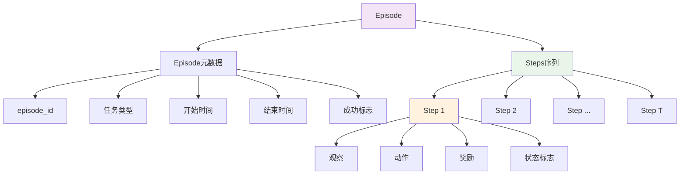
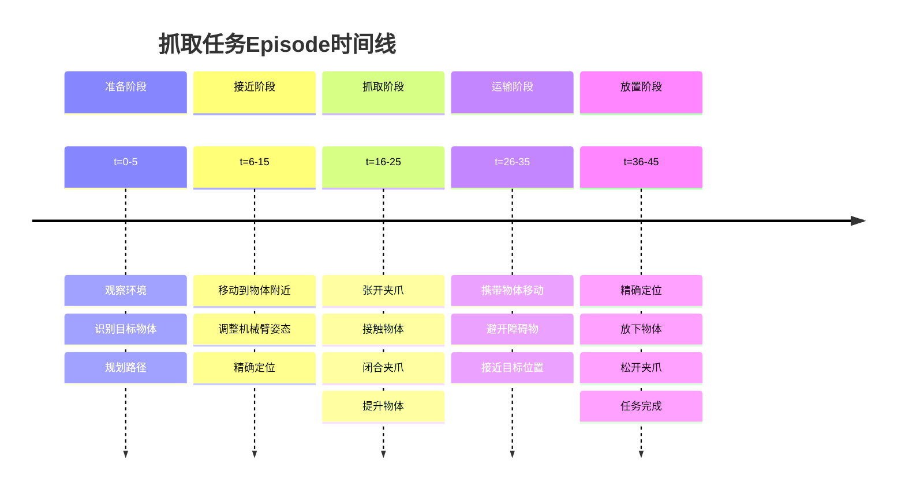
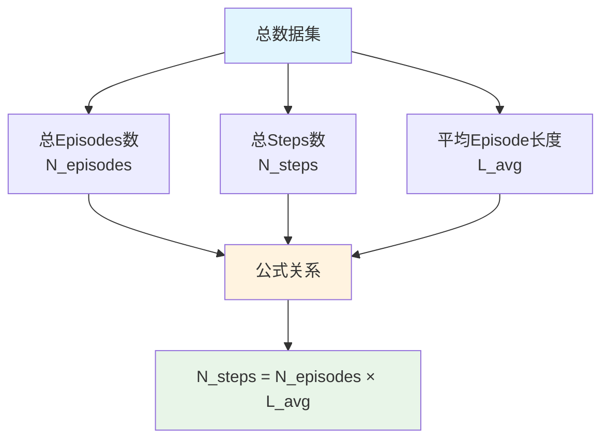
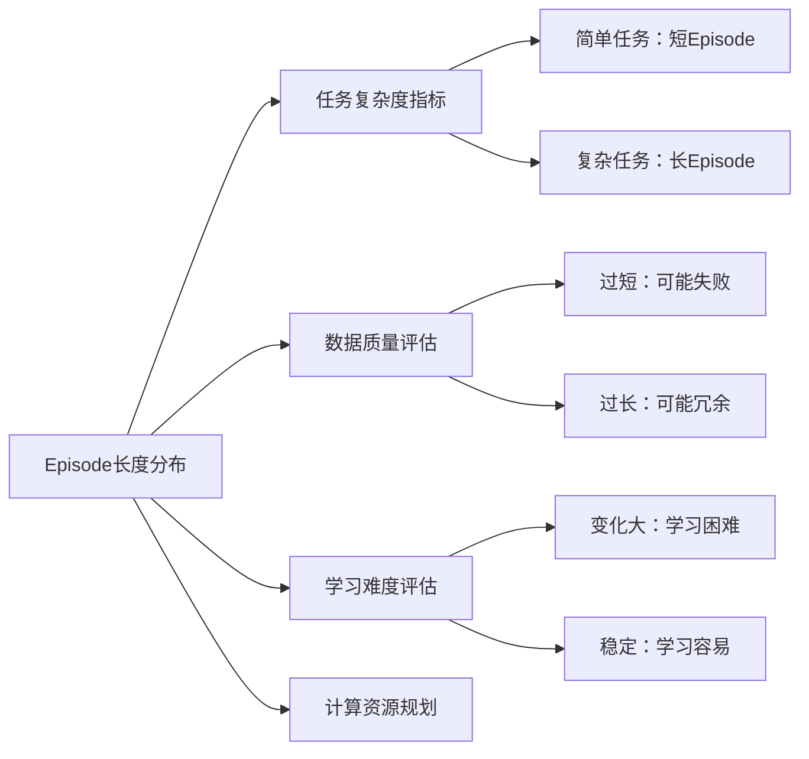
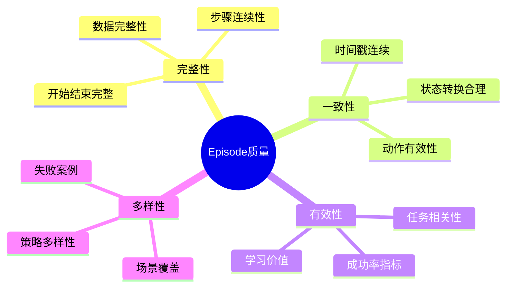
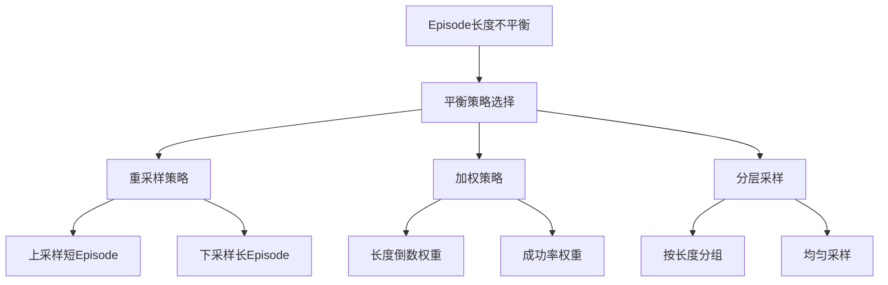

# Episode 概念详解：机器人学习中的核心数据单元

本文档全面介绍了机器人学习和强化学习中Episode（回合/轨迹）的概念、结构、数学关系及其实际应用。

## 目录

1. [Episode 基本概念](#episode-基本概念)
2. [Episode 数据结构](#episode-数据结构)
3. [Episode 实例分析](#episode-实例分析)
4. [数学关系与统计](#数学关系与统计)
5. [Episode 长度分析](#episode-长度分析)
6. [数据质量评估](#数据质量评估)
7. [优化策略](#优化策略)
8. [实际应用场景](#实际应用场景)

---

## Episode 基本概念

### 定义

**Episode（回合/轨迹）** 是机器人学习中的基本数据单元，表示从任务开始到任务结束的完整执行序列。每个Episode包含了机器人完成一个特定任务的全部时间步骤。

### 核心特征


| 特征 | 说明 | 示例 |
|------|------|------|
| **时间边界** | 明确的开始和结束时间点 | t=0 到 t=T |
| **连续性** | 步骤之间具有时间连续性 | 每个步骤都有时间戳 |
| **完整性** | 包含完成任务的所有必要信息 | 从拿起物体到放置完成 |
| **原子性** | Episode是不可分割的学习单元 | 不能随意截断或合并 |

---

## Episode 数据结构

### 标准Episode组成



### Episode数据格式

```python
episode = {
    # Episode级别元数据
    "episode_metadata": {
        "episode_id": "ep_001",
        "task_type": "pick_and_place",
        "episode_length": 45,
        "success": True,
        "start_time": "2024-01-01T10:00:00",
        "end_time": "2024-01-01T10:02:15"
    },
    
    # 步骤序列
    "steps": [
        {
            "step_id": 0,
            "timestamp": 0.0,
            "observation": {
                "image_primary": <camera_image>,
                "image_wrist": <wrist_camera>,
                "proprio": [0.1, 0.2, 0.3, ...],  # 机器人关节状态
                "object_position": [x, y, z]
            },
            "action": [dx, dy, dz, gripper_action],
            "reward": 0.0,
            "done": False,
            "info": {}
        },
        # ... 更多步骤
        {
            "step_id": 44,
            "timestamp": 2.2,
            "observation": {...},
            "action": [0, 0, 0, 1],  # 最终动作
            "reward": 1.0,
            "done": True,
            "info": {"task_completed": True}
        }
    ]
}
```

### 关键字段说明

| 字段类别 | 字段名 | 数据类型 | 说明 |
|----------|--------|----------|------|
| **观察** | `image_*` | numpy.ndarray | 相机图像数据 |
| | `proprio` | list/array | 机器人本体感觉数据 |
| | `object_*` | list/array | 物体位置、状态信息 |
| **动作** | `action` | list/array | 机器人执行的动作向量 |
| **状态** | `reward` | float | 即时奖励信号 |
| | `done` | bool | Episode结束标志 |
| | `info` | dict | 额外的调试或元信息 |

---

## Episode 实例分析

### 案例1：机器人抓取任务

**任务描述**: 机器人需要抓取桌面上的红色方块并放置到指定位置。



### 详细步骤分解

| 时间步 | 主要动作 | 观察要点 | 奖励设计 |
|--------|----------|----------|----------|
| **t=0-5** | 扫描环境 | 物体检测、位置估计 | 0.0（中性） |
| **t=6-15** | 移动接近 | 距离缩小、姿态调整 | +0.1（接近奖励） |
| **t=16-20** | 张开夹爪 | 夹爪状态、接触传感器 | 0.0 |
| **t=21-25** | 抓取物体 | 抓取成功、力反馈 | +0.5（抓取成功） |
| **t=26-35** | 运输移动 | 物体保持、路径规划 | +0.1（持续运输） |
| **t=36-40** | 精确定位 | 目标位置对齐 | +0.2（位置准确） |
| **t=41-45** | 放置完成 | 物体稳定放置 | +1.0（任务完成） |

### 案例2：导航任务Episode

**任务描述**: 移动机器人从起点导航到目标位置，避开障碍物。

```python
navigation_episode = {
    "episode_metadata": {
        "task_type": "navigation",
        "start_position": [0, 0, 0],
        "goal_position": [10, 5, 0],
        "episode_length": 120,
        "path_efficiency": 0.85
    },
    "key_events": [
        {"step": 0, "event": "任务开始", "position": [0, 0, 0]},
        {"step": 30, "event": "检测到障碍物", "position": [3, 1, 0]},
        {"step": 45, "event": "规划绕行路径", "position": [4, 2, 0]},
        {"step": 90, "event": "接近目标区域", "position": [9, 4, 0]},
        {"step": 120, "event": "到达目标", "position": [10, 5, 0]}
    ]
}
```

---

## 数学关系与统计

### 基本数学关系

在机器人学习数据集中，Episodes、Steps和平均Episode长度之间存在重要的数学关系：

#### 核心公式

```
总步数 = 总Episodes数 × 平均Episode长度
Total_Steps = Total_Episodes × Average_Episode_Length
```

#### 衍生计算

```python
# 1. 计算平均Episode长度
Average_Episode_Length = Total_Steps / Total_Episodes

# 2. 计算总Episodes数
Total_Episodes = Total_Steps / Average_Episode_Length

# 3. 计算总步数
Total_Steps = Total_Episodes × Average_Episode_Length
```

### 关系图示



### 实际数据示例

| 数据集 | Episodes数 | 总Steps数 | 平均长度 | 验证计算 |
|--------|------------|-----------|----------|----------|
| **抓取数据集** | 1,000 | 45,000 | 45.0 | ✓ 1,000 × 45.0 = 45,000 |
| **导航数据集** | 500 | 60,000 | 120.0 | ✓ 500 × 120.0 = 60,000 |
| **操作数据集** | 2,000 | 140,000 | 70.0 | ✓ 2,000 × 70.0 = 140,000 |

### 统计分析工具

```python
def analyze_episode_statistics(dataset):
    """分析Episode统计信息"""
    episode_lengths = [len(episode['steps']) for episode in dataset]
    
    statistics = {
        'total_episodes': len(dataset),
        'total_steps': sum(episode_lengths),
        'average_length': np.mean(episode_lengths),
        'median_length': np.median(episode_lengths),
        'std_length': np.std(episode_lengths),
        'min_length': min(episode_lengths),
        'max_length': max(episode_lengths)
    }
    
    # 验证数学关系
    calculated_steps = statistics['total_episodes'] * statistics['average_length']
    assert abs(calculated_steps - statistics['total_steps']) < 1e-6
    
    return statistics
```

---

## Episode 长度分析

### Episode长度分布的重要性

Episode长度的分布反映了任务的复杂性和数据集的质量特征：



### 不同任务的Episode长度特征

| 任务类型 | 典型长度范围 | 分布特征 | 质量指标 |
|----------|--------------|----------|----------|
| **简单抓取** | 20-50 steps | 正态分布 | 低方差较好 |
| **复杂操作** | 50-150 steps | 右偏分布 | 适中方差 |
| **长期导航** | 100-500 steps | 多峰分布 | 路径效率 |
| **协作任务** | 200-1000 steps | 广泛分布 | 协调成功率 |

### 长度分布可视化

```python
import matplotlib.pyplot as plt
import numpy as np

def plot_episode_length_distribution(episode_lengths, task_name):
    """绘制Episode长度分布图"""
    fig, (ax1, ax2) = plt.subplots(1, 2, figsize=(12, 5))
    
    # 直方图
    ax1.hist(episode_lengths, bins=30, alpha=0.7, color='skyblue', edgecolor='black')
    ax1.set_xlabel('Episode Length')
    ax1.set_ylabel('Frequency')
    ax1.set_title(f'{task_name} - Episode Length Distribution')
    ax1.grid(True, alpha=0.3)
    
    # 箱线图
    ax2.boxplot(episode_lengths)
    ax2.set_ylabel('Episode Length')
    ax2.set_title(f'{task_name} - Episode Length Box Plot')
    ax2.grid(True, alpha=0.3)
    
    plt.tight_layout()
    return fig
```

---

## 数据质量评估

### Episode质量评估维度



### 质量检查清单

| 检查项 | 标准 | 检查方法 | 修复建议 |
|--------|------|----------|----------|
| **长度合理性** | 在预期范围内 | 统计分析 | 过滤异常Episode |
| **时间连续性** | 时间戳递增 | 序列检查 | 重新排序或插值 |
| **数据完整性** | 无缺失值 | 空值检测 | 删除或填充 |
| **动作有效性** | 在动作空间内 | 范围检查 | 截断或标记 |
| **状态一致性** | 状态转换合理 | 物理检查 | 重新标注 |

### 自动化质量评估

```python
def evaluate_episode_quality(episode):
    """评估单个Episode的质量"""
    quality_metrics = {}
    
    # 1. 长度检查
    length = len(episode['steps'])
    quality_metrics['length_check'] = 10 <= length <= 1000
    
    # 2. 时间连续性
    timestamps = [step['timestamp'] for step in episode['steps']]
    quality_metrics['time_continuity'] = all(
        timestamps[i] <= timestamps[i+1] for i in range(len(timestamps)-1)
    )
    
    # 3. 数据完整性
    complete_steps = sum(1 for step in episode['steps'] 
                        if all(key in step for key in ['observation', 'action']))
    quality_metrics['completeness'] = complete_steps / length
    
    # 4. 动作有效性
    actions = [step['action'] for step in episode['steps'] if 'action' in step]
    valid_actions = sum(1 for action in actions 
                       if all(-1 <= x <= 1 for x in action))  # 假设动作范围[-1,1]
    quality_metrics['action_validity'] = valid_actions / len(actions) if actions else 0
    
    # 5. 整体质量评分
    quality_metrics['overall_score'] = np.mean([
        quality_metrics['length_check'],
        quality_metrics['time_continuity'],
        quality_metrics['completeness'],
        quality_metrics['action_validity']
    ])
    
    return quality_metrics
```

---

## 优化策略

### Episode数据平衡策略

不同长度的Episodes对训练的影响不同，需要采用平衡策略：



### 优化方案对比

| 策略 | 优点 | 缺点 | 适用场景 |
|------|------|------|----------|
| **重采样** | 简单直接 | 可能丢失信息 | 数据充足时 |
| **加权训练** | 保留所有数据 | 实现复杂 | 数据稀缺时 |
| **分层采样** | 平衡且多样 | 需要预处理 | 生产环境 |
| **动态平衡** | 自适应调整 | 计算开销大 | 在线学习 |

### 实现示例

```python
def balance_episodes_by_length(episodes, target_distribution='uniform'):
    """根据长度平衡Episode分布"""
    
    # 按长度分组
    length_groups = {}
    for episode in episodes:
        length = len(episode['steps'])
        length_bin = length // 10 * 10  # 按10步分组
        if length_bin not in length_groups:
            length_groups[length_bin] = []
        length_groups[length_bin].append(episode)
    
    if target_distribution == 'uniform':
        # 每组采样相同数量
        min_count = min(len(group) for group in length_groups.values())
        balanced_episodes = []
        for group in length_groups.values():
            balanced_episodes.extend(np.random.choice(group, min_count, replace=False))
    
    elif target_distribution == 'weighted':
        # 根据成功率加权
        balanced_episodes = []
        for group in length_groups.values():
            success_rate = np.mean([ep.get('success', False) for ep in group])
            sample_size = int(len(group) * success_rate)
            balanced_episodes.extend(np.random.choice(group, sample_size, replace=False))
    
    return balanced_episodes
```

---

## 实际应用场景

### 1. 模型训练优化

```python
class EpisodeAwareDataLoader:
    """Episode感知的数据加载器"""
    
    def __init__(self, episodes, batch_size, episode_sampling='uniform'):
        self.episodes = episodes
        self.batch_size = batch_size
        self.episode_sampling = episode_sampling
        
    def __iter__(self):
        if self.episode_sampling == 'length_balanced':
            episodes = self.balance_by_length()
        elif self.episode_sampling == 'success_weighted':
            episodes = self.weight_by_success()
        else:
            episodes = self.episodes
            
        # 从Episodes中采样步骤
        for batch in self.sample_steps(episodes):
            yield batch
    
    def balance_by_length(self):
        """按长度平衡Episodes"""
        # 实现长度平衡逻辑
        pass
    
    def weight_by_success(self):
        """按成功率加权Episodes"""
        # 实现成功率加权逻辑
        pass
```

### 2. 数据集统计分析

```python
def comprehensive_episode_analysis(dataset_path):
    """全面的Episode数据分析"""
    
    # 加载数据
    episodes = load_episodes(dataset_path)
    
    # 基础统计
    stats = {
        'total_episodes': len(episodes),
        'total_steps': sum(len(ep['steps']) for ep in episodes),
        'success_rate': np.mean([ep.get('success', False) for ep in episodes])
    }
    
    # 长度分析
    lengths = [len(ep['steps']) for ep in episodes]
    stats.update({
        'avg_length': np.mean(lengths),
        'median_length': np.median(lengths),
        'std_length': np.std(lengths),
        'length_range': (min(lengths), max(lengths))
    })
    
    # 任务类型分析
    task_types = {}
    for episode in episodes:
        task_type = episode.get('task_type', 'unknown')
        if task_type not in task_types:
            task_types[task_type] = {'count': 0, 'avg_length': 0, 'success_rate': 0}
        task_types[task_type]['count'] += 1
    
    # 生成报告
    generate_analysis_report(stats, task_types)
    
    return stats
```

### 3. 在线学习系统

```python
class OnlineEpisodeManager:
    """在线Episode管理器"""
    
    def __init__(self, max_episodes=10000):
        self.episodes = []
        self.max_episodes = max_episodes
        self.current_episode = None
        
    def start_new_episode(self, task_info):
        """开始新的Episode"""
        self.current_episode = {
            'episode_id': len(self.episodes),
            'task_info': task_info,
            'steps': [],
            'start_time': time.time()
        }
        
    def add_step(self, observation, action, reward, done, info=None):
        """添加新的步骤"""
        if self.current_episode is None:
            raise ValueError("No active episode")
            
        step = {
            'step_id': len(self.current_episode['steps']),
            'observation': observation,
            'action': action,
            'reward': reward,
            'done': done,
            'info': info or {},
            'timestamp': time.time() - self.current_episode['start_time']
        }
        
        self.current_episode['steps'].append(step)
        
        if done:
            self.end_current_episode()
    
    def end_current_episode(self):
        """结束当前Episode"""
        if self.current_episode:
            self.current_episode['end_time'] = time.time()
            self.current_episode['episode_length'] = len(self.current_episode['steps'])
            
            # 添加到Episode库
            self.episodes.append(self.current_episode)
            
            # 维护最大Episode数限制
            if len(self.episodes) > self.max_episodes:
                self.episodes.pop(0)  # 移除最旧的Episode
            
            self.current_episode = None
```

---

## 总结

Episode作为机器人学习的核心数据单元，其重要性体现在：

### 关键要点

1. **结构完整性**: Episode提供了完整的任务执行轨迹，是学习的基本单元
2. **时间连续性**: 保持了动作-状态转换的时序关系
3. **统计特性**: Episode长度分布反映了任务复杂度和数据质量
4. **数学关系**: 总步数 = Episodes数 × 平均长度，为资源规划提供依据

### 最佳实践

- **数据收集**: 确保Episode的完整性和多样性
- **质量控制**: 实施自动化的Episode质量检查
- **平衡策略**: 根据应用场景选择合适的Episode平衡方法
- **在线管理**: 在实时系统中高效管理Episode数据

### 应用价值

Episode概念不仅是数据组织的基础，更是连接机器人感知、决策和学习的桥梁。正确理解和应用Episode概念，对于构建高效的机器人学习系统至关重要。

通过系统化的Episode管理和分析，可以显著提升机器人学习的数据质量和训练效率，为实现更智能的机器人系统奠定坚实基础。 