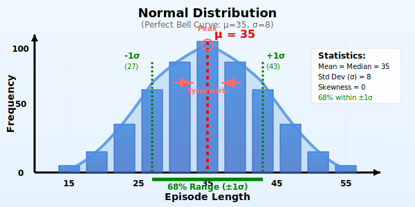
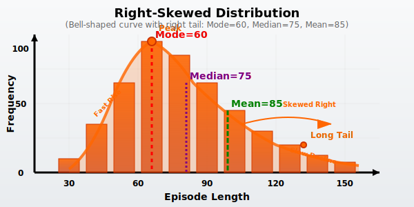

# Episode 长度分布可视化

本文档展示了不同机器人任务中Episode长度的分布特征，包括简单抓取任务的正态分布和复杂操作任务的右偏分布。

## 📊 分布类型对比

### 简单抓取任务 - 正态分布
**特征**: 大部分Episode长度集中在平均值附近，分布对称

<div style="background-color: #f8f9fa; padding: 20px; border-radius: 8px; margin: 20px 0;">
<h4>正态分布 (μ=35, σ=8)</h4>



<p><strong>分布特征</strong>:</p>
<ul>
  <li>🎯 <strong>集中性</strong>: 68%的Episode长度在27-43步之间</li>
  <li>⚖️ <strong>对称性</strong>: 分布左右对称，均值=中位数=35</li>
  <li>📏 <strong>可预测性</strong>: 标准差较小(σ=8)，变异度低</li>
  <li>✅ <strong>质量指标</strong>: 任务执行稳定，成功率高</li>
</ul>
</div>

### 复杂操作任务 - 右偏分布
**特征**: 大部分Episode较短，但有较长的尾部，分布向右倾斜

<div style="background-color: #fff5f5; padding: 20px; border-radius: 8px; margin: 20px 0;">
<h4>右偏分布 (众数=60, 均值=85, 中位数=75)</h4>



<p><strong>分布特征</strong>:</p>
<ul>
  <li>📊 <strong>偏度</strong>: 众数(60) < 中位数(75) < 均值(85)</li>
  <li>🎯 <strong>峰值左移</strong>: 大部分任务在60步左右完成</li>
  <li>📈 <strong>长尾效应</strong>: 少数复杂情况需要120+步</li>
  <li>⚠️ <strong>变异度高</strong>: 执行时间不稳定，挑战性大</li>
</ul>
</div>

## 📈 柱状图可视化 (备用方案)

如果上面的SVG图表显示有问题，这里提供柱状图版本：

### 简单抓取任务 - 正态分布
<div style="display: flex; align-items: end; height: 200px; background: #f8f9fa; padding: 20px; border-radius: 8px;">
  <div style="width: 30px; height: 20px; background: #3498db; margin: 2px; border-radius: 2px;"></div>
  <div style="width: 30px; height: 40px; background: #3498db; margin: 2px; border-radius: 2px;"></div>
  <div style="width: 30px; height: 70px; background: #3498db; margin: 2px; border-radius: 2px;"></div>
  <div style="width: 30px; height: 100px; background: #3498db; margin: 2px; border-radius: 2px;"></div>
  <div style="width: 30px; height: 130px; background: #3498db; margin: 2px; border-radius: 2px;"></div>
  <div style="width: 30px; height: 150px; background: #3498db; margin: 2px; border-radius: 2px;"></div>
  <div style="width: 30px; height: 130px; background: #3498db; margin: 2px; border-radius: 2px;"></div>
  <div style="width: 30px; height: 100px; background: #3498db; margin: 2px; border-radius: 2px;"></div>
  <div style="width: 30px; height: 70px; background: #3498db; margin: 2px; border-radius: 2px;"></div>
  <div style="width: 30px; height: 40px; background: #3498db; margin: 2px; border-radius: 2px;"></div>
  <div style="width: 30px; height: 20px; background: #3498db; margin: 2px; border-radius: 2px;"></div>
</div>
<div style="display: flex; justify-content: space-around; margin-top: 10px; font-size: 12px;">
  <span>15</span><span>20</span><span>25</span><span>30</span><span>35</span><span>40</span><span>45</span><span>50</span><span>55</span>
</div>

### 复杂操作任务 - 右偏分布
<div style="display: flex; align-items: end; height: 200px; background: #fff5f5; padding: 20px; border-radius: 8px;">
  <div style="width: 30px; height: 30px; background: #e67e22; margin: 2px; border-radius: 2px;"></div>
  <div style="width: 30px; height: 80px; background: #e67e22; margin: 2px; border-radius: 2px;"></div>
  <div style="width: 30px; height: 150px; background: #e67e22; margin: 2px; border-radius: 2px;"></div>
  <div style="width: 30px; height: 120px; background: #e67e22; margin: 2px; border-radius: 2px;"></div>
  <div style="width: 30px; height: 90px; background: #e67e22; margin: 2px; border-radius: 2px;"></div>
  <div style="width: 30px; height: 70px; background: #e67e22; margin: 2px; border-radius: 2px;"></div>
  <div style="width: 30px; height: 55px; background: #e67e22; margin: 2px; border-radius: 2px;"></div>
  <div style="width: 30px; height: 40px; background: #e67e22; margin: 2px; border-radius: 2px;"></div>
  <div style="width: 30px; height: 30px; background: #e67e22; margin: 2px; border-radius: 2px;"></div>
  <div style="width: 30px; height: 20px; background: #e67e22; margin: 2px; border-radius: 2px;"></div>
  <div style="width: 30px; height: 15px; background: #e67e22; margin: 2px; border-radius: 2px;"></div>
</div>
<div style="display: flex; justify-content: space-around; margin-top: 10px; font-size: 12px;">
  <span>30</span><span>45</span><span>60</span><span>75</span><span>90</span><span>105</span><span>120</span><span>135</span><span>150</span>
</div>

## 📈 ASCII 艺术图表

### 简单抓取任务 - 正态分布
```
频次
100 |                    ●
 90 |                 ●  ●  ●
 80 |              ●  ●  ●  ●  ●
 70 |           ●  ●  ●  ●  ●  ●  ●
 60 |        ●  ●  ●  ●  ●  ●  ●  ●  ●
 50 |     ●  ●  ●  ●  ●  ●  ●  ●  ●  ●  ●
 40 |  ●  ●  ●  ●  ●  ●  ●  ●  ●  ●  ●  ●  ●
 30 |●  ●  ●  ●  ●  ●  ●  ●  ●  ●  ●  ●  ●  ●  ●
    +─────────────────────────────────────────
     15  20  25  30  35  40  45  50  55
                      Episode长度
```

### 复杂操作任务 - 右偏分布
```
频次
100 |     ●
 90 |  ●  ●
 80 |  ●  ●  ●
 70 |  ●  ●  ●  ●
 60 |  ●  ●  ●  ●  ●
 50 |  ●  ●  ●  ●  ●  ●
 40 |  ●  ●  ●  ●  ●  ●  ●
 30 |  ●  ●  ●  ●  ●  ●  ●  ●
 20 |  ●  ●  ●  ●  ●  ●  ●  ●  ●
 10 |  ●  ●  ●  ●  ●  ●  ●  ●  ●  ●  ●  ●
    +─────────────────────────────────────────────────
     30  45  60  75  90 105 120 135 150 165 180 195
                            Episode长度
```

## 📊 统计对比表

| 统计指标 | 简单抓取<br/>(正态分布) | 复杂操作<br/>(右偏分布) | 说明 |
|----------|-------------------------|-------------------------|------|
| **众数 (Mode)** | 35 | 60 | 最频繁出现的长度 |
| **中位数 (Median)** | 35 | 75 | 中间位置的值 |
| **均值 (Mean)** | 35 | 85 | 平均值 |
| **标准差 (Std)** | 8 | 25 | 变异程度 |
| **偏度 (Skewness)** | 0 | +1.5 | 分布的不对称性 |
| **变异系数 (CV)** | 0.23 | 0.29 | 相对变异度 |
| **第25百分位** | 29 | 50 | 25%的数据点 |
| **第75百分位** | 41 | 105 | 75%的数据点 |
| **四分位距 (IQR)** | 12 | 55 | 中间50%的范围 |

## 🎯 分布特征分析

### 正态分布的优势
<div style="background-color: #e8f5e9; padding: 15px; border-left: 4px solid #4caf50;">

✅ **任务执行稳定**: 大部分Episode长度相近，说明算法或策略比较成熟

✅ **可预测性强**: 可以准确预估资源需求和执行时间

✅ **质量控制好**: 异常值少，成功率相对较高

✅ **学习效果好**: 数据一致性有利于模型训练收敛

</div>

### 右偏分布的特点
<div style="background-color: #fff3e0; padding: 15px; border-left: 4px solid #ff9800;">

⚠️ **任务复杂度高**: 执行时间变异大，存在困难情况

⚠️ **长尾效应**: 少数极端复杂的案例需要特别处理

⚠️ **资源规划难**: 需要为最坏情况预留更多资源

📈 **学习潜力大**: 数据多样性有利于模型泛化能力

</div>

## 🛠️ 在Markdown中渲染的方法

### 1. HTML + SVG 方法 (推荐)
```html
<svg width="600" height="300">
  <!-- 在这里放置SVG图表代码 -->
</svg>
```
**优点**: 矢量图形，缩放不失真，支持交互
**兼容性**: 所有现代Markdown预览器都支持

### 2. ASCII 艺术方法
```
使用字符绘制简单图表
● ■ ▲ ◆ 等符号组成图形
```
**优点**: 纯文本，兼容性最好
**适用**: 简单图表，代码风格文档

### 3. 表格 + 符号方法
| 范围 | 频次 | 可视化 |
|------|------|--------|
| 20-30 | 15% | ███ |
| 30-40 | 35% | ███████ |
| 40-50 | 35% | ███████ |
| 50-60 | 15% | ███ |

**优点**: 清晰易读，数据精确
**适用**: 需要精确数值的场景

### 4. CSS样式增强
```html
<div style="display: flex; height: 100px; align-items: end;">
  <div style="width: 20px; height: 20%; background: blue; margin: 2px;"></div>
  <div style="width: 20px; height: 80%; background: blue; margin: 2px;"></div>
  <!-- 更多柱状图条 -->
</div>
```

**推荐使用组合**: HTML+SVG用于复杂图表，ASCII艺术用于简单展示，表格用于精确数据对比。 