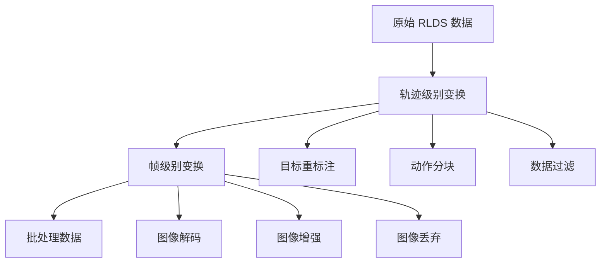
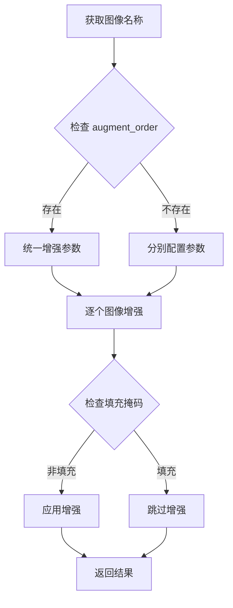
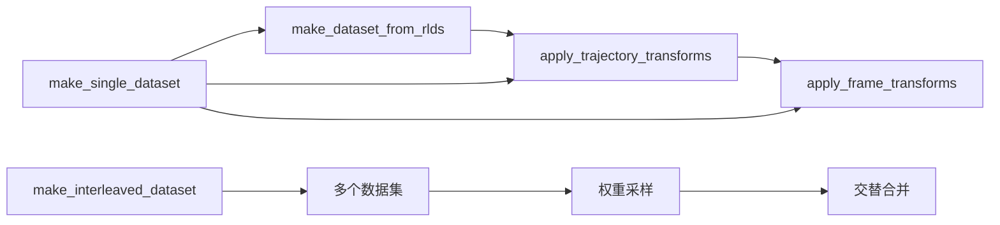
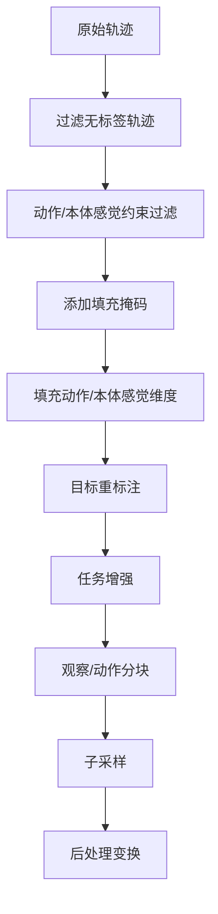
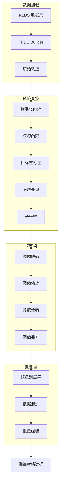

# Octo 数据管道文档

本文档详细介绍了 Octo 机器人学习框架中的数据处理管道，包括观察变换和数据集处理模块。

## 目录

1. [概述](#概述)
2. [观察变换模块 (obs_transforms.py)](#观察变换模块)
3. [数据集处理模块 (dataset.py)](#数据集处理模块)
4. [数据流架构](#数据流架构)
5. [最佳实践](#最佳实践)
6. [示例用法](#示例用法)

---

## 概述

Octo 数据管道采用分层设计，主要包含两个层次的数据变换：

- **观察级别变换** (`obs_transforms.py`): 在单帧级别操作观察字典
- **轨迹级别变换** (`dataset.py`): 处理完整轨迹序列和数据集构建

### 核心设计原则



---

## 观察变换模块

### 核心功能

| 函数 | 功能 | 应用场景 |
|------|------|----------|
| `augment()` | 图像数据增强 | 训练时增加数据多样性 |
| `image_dropout()` | 随机图像丢弃 | 提高模型鲁棒性 |
| `decode_and_resize()` | 图像解码与缩放 | 数据预处理标准化 |

### 详细函数说明

#### 1. augment()

```python
def augment(
    obs: dict, 
    seed: tf.Tensor, 
    augment_kwargs: Union[dict, Mapping[str, dict]]
) -> dict
```

**功能**: 对观察字典中的图像进行数据增强，跳过填充图像。

**参数说明**:
- `obs`: 包含图像的观察字典
- `seed`: TensorFlow 随机种子
- `augment_kwargs`: 增强参数配置
  - 如果包含 `augment_order` 键：应用相同增强到所有图像
  - 否则：字典映射图像名称到对应增强参数

**关键特性**:
- 自动检测以 `image_` 开头的键
- 使用 `pad_mask_dict` 跳过填充图像
- 为每个图像使用不同的随机种子

**代码流程**:


#### 2. image_dropout()

```python
def image_dropout(
    obs: dict,
    seed: tf.Tensor,
    dropout_prob: float,
    always_keep_key: Optional[str] = None,
) -> dict
```

**功能**: 独立地随机丢弃图像键，但始终保持至少一个图像存在。

**参数说明**:
- `dropout_prob`: 每个图像的丢弃概率
- `always_keep_key`: 始终保留的图像键（可选）

**算法逻辑**:
1. 识别所有图像键和对应的填充掩码
2. 选择一个必须保留的图像（随机或指定）
3. 对其他图像独立应用丢弃概率
4. 更新填充掩码和图像数据

#### 3. decode_and_resize()

```python
def decode_and_resize(
    obs: dict,
    resize_size: Union[Tuple[int, int], Mapping[str, Tuple[int, int]]],
    depth_resize_size: Union[Tuple[int, int], Mapping[str, Tuple[int, int]]],
) -> dict
```

**功能**: 解码图像和深度图像，并可选地调整它们的大小。

**支持的数据类型**:
- **图像**: tf.string (编码) → tf.uint8
- **深度图**: tf.string (编码) → tf.float32

**处理策略**:
- 空字符串 → 填充图像（全零）
- 编码字符串 → 解码 + 可选缩放
- 已解码数据 → 直接缩放

---

## 数据集处理模块

### 主要函数架构



### 详细函数说明

#### 1. make_dataset_from_rlds()

**功能**: 从 RLDS 存储加载特定数据集并将其转换为标准化格式。

**核心参数**:

| 参数类别 | 参数名 | 说明 |
|----------|--------|------|
| 数据源 | `name` | RLDS 数据集名称 |
| | `data_dir` | 数据目录路径 |
| 观察提取 | `image_obs_keys` | RGB 图像键映射 |
| | `depth_obs_keys` | 深度图像键映射 |
| | `proprio_obs_key` | 本体感觉键 |
| 任务配置 | `language_key` | 语言指令键 |
| 标准化 | `action_proprio_normalization_type` | 归一化类型 |
| | `dataset_statistics` | 数据集统计信息 |

**数据结构转换**:

```python
# 输入格式（原始 RLDS）
{
    "observation": {
        "workspace": <image_data>,
        "wrist": <image_data>,
        "joint_positions": <proprio_data>
    },
    "action": <action_data>,
    "language_instruction": <text_data>
}

# 输出格式（标准化）
{
    "observation": {
        "image_primary": <processed_workspace>,
        "image_wrist": <processed_wrist>,
        "proprio": <normalized_joint_positions>,
        "timestep": <time_indices>
    },
    "task": {
        "language_instruction": <text_data>
    },
    "action": <normalized_action>,
    "dataset_name": <dataset_identifier>
}
```

#### 2. apply_trajectory_transforms()

**功能**: 应用轨迹级别的常见变换，如过滤、分块、添加目标等。

**变换流水线**:



**关键参数**:
- `window_size`: 观察和动作的窗口大小
- `action_horizon`: 动作块大小（当前和未来动作）
- `goal_relabeling_strategy`: 目标重标注策略
- `subsample_length`: 轨迹子采样长度

#### 3. apply_frame_transforms()

**功能**: 应用帧级别变换，通常更加 CPU 密集（如图像解码、缩放）。

**变换流程**:
1. **图像解码和缩放**: 将编码图像转换为标准尺寸
2. **训练时增强**: 
   - 图像数据增强
   - 图像随机丢弃
3. **应用到分块数据**: 同时处理分块观察和任务字典

#### 4. make_interleaved_dataset()

**功能**: 从多个数据集创建交替合并的数据集。

**核心特性**:
- **加权采样**: 根据指定权重从不同数据集采样
- **权重平衡**: 可选根据数据集大小平衡权重
- **线程分配**: 根据采样权重分配并行处理线程
- **帧级别交替**: 在帧级别进行数据集交替，而非轨迹级别

**权重计算公式**:
```python
if balance_weights:
    sample_weights = sample_weights * dataset_sizes
sample_weights = sample_weights / sum(sample_weights)
```

---

## 数据流架构

### 完整数据流图



### 数据维度变化

| 阶段 | 数据形状 | 说明 |
|------|----------|------|
| 原始轨迹 | `[T, ...]` | T = 轨迹长度 |
| 分块后 | `[T-W+1, W, ...]` | W = 窗口大小 |
| 展平后 | `[N, W, ...]` | N = 总帧数 |
| 批处理后 | `[B, W, ...]` | B = 批大小 |

---

## 最佳实践

### 1. 数据增强配置

```python
# 推荐的训练增强配置
image_augment_kwargs = {
    "augment_order": ["random_resized_crop", "color_jitter", "random_flip"],
    "random_resized_crop": {"size": [224, 224], "scale": [0.8, 1.0]},
    "color_jitter": {"brightness": 0.2, "contrast": 0.2, "saturation": 0.2},
    "random_flip": {"lr": True}
}
```

### 2. 多数据集权重设置

```python
# 方法 1: 均匀采样
sample_weights = [1.0, 1.0, 1.0]

# 方法 2: 基于数据集大小平衡
sample_weights = [1.0, 1.0, 1.0]
balance_weights = True

# 方法 3: 手动权重分配
sample_weights = [0.5, 0.3, 0.2]  # 优先采样第一个数据集
```

### 3. 性能优化建议

| 优化策略 | 配置参数 | 建议值 |
|----------|----------|--------|
| 并行读取 | `num_parallel_reads` | `tf.data.AUTOTUNE` |
| 并行变换 | `num_parallel_calls` | `tf.data.AUTOTUNE` |
| 内存预算 | `ram_budget` | `1` (GB) |
| 缓冲区大小 | `shuffle_buffer_size` | `100000` |

---

## 示例用法

### 单数据集处理

```python
# 配置单个数据集
dataset_kwargs = {
    "name": "berkeley_autolab_ur5",
    "data_dir": "/path/to/data",
    "image_obs_keys": {"primary": "workspace", "wrist": "wrist"},
    "proprio_obs_key": "robot_state",
    "language_key": "language_instruction",
}

# 创建数据集
dataset = make_single_dataset(
    dataset_kwargs=dataset_kwargs,
    train=True,
    traj_transform_kwargs={
        "window_size": 2,
        "action_horizon": 4,
        "goal_relabeling_strategy": "uniform",
    },
    frame_transform_kwargs={
        "resize_size": (224, 224),
        "image_augment_kwargs": image_augment_kwargs,
        "image_dropout_prob": 0.1,
    },
)
```

### 多数据集交替

```python
# 配置多个数据集
dataset_kwargs_list = [
    {
        "name": "berkeley_autolab_ur5", 
        "data_dir": "/path/to/data1",
        "image_obs_keys": {"primary": "workspace"},
    },
    {
        "name": "stanford_kuka_multimodal", 
        "data_dir": "/path/to/data2",
        "image_obs_keys": {"primary": "camera_1"},
    },
]

# 创建交替数据集
dataset = make_interleaved_dataset(
    dataset_kwargs_list=dataset_kwargs_list,
    sample_weights=[0.6, 0.4],
    train=True,
    shuffle_buffer_size=100000,
    batch_size=32,
    balance_weights=True,
)
```

### 自定义变换函数

```python
# 自定义观察变换
def apply_obs_transform(fn: Callable[[dict], dict], frame: dict) -> dict:
    # 任务未分块 - 直接应用函数
    frame["task"] = fn(frame["task"])
    # 观察已分块 - 沿第一轴应用函数
    frame["observation"] = dl.vmap(fn)(frame["observation"])
    return frame

# 使用示例
dataset = dataset.frame_map(
    partial(apply_obs_transform, custom_transform_function),
    num_parallel_calls=tf.data.AUTOTUNE
)
```

---

## 总结

Octo 数据管道提供了一个灵活且高效的框架来处理机器人学习数据。通过分层的变换设计和模块化的函数接口，用户可以：

1. **灵活配置**: 根据具体任务需求调整数据处理参数
2. **高效处理**: 利用 TensorFlow 的并行能力加速数据处理
3. **标准化格式**: 将不同来源的数据统一为一致的格式
4. **多数据集融合**: 轻松组合多个数据集进行联合训练

该管道特别适用于需要处理大规模、多模态机器人数据的场景，为机器人学习模型提供了可靠的数据基础。 